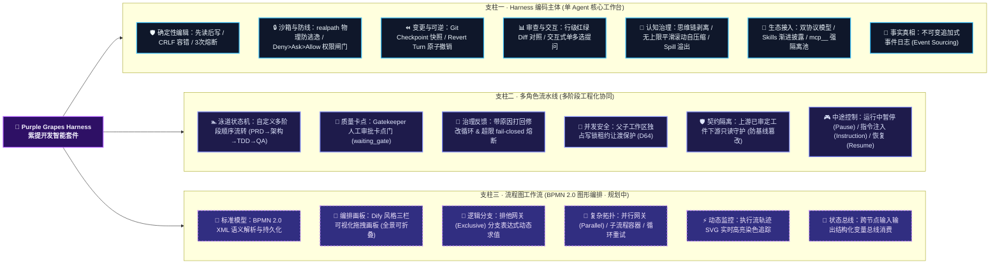
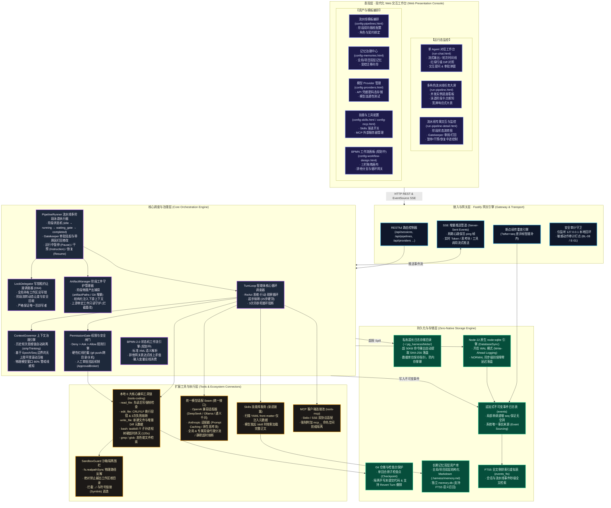

<div align="center">

# 🍇 Purple Grapes Harness (PGH)
### 中文名：紫提开发智能套件 (PGH Harness)

**自主可控 · 零 Native 编译 · 面向软件工程全生命周期的可插拔编码 Agent 运行时与多形态协作工作台**

[](https://nodejs.org/)
[](https://www.typescriptlang.org/)
[]()
[]()
[]()
[]()

[产品定位](#-产品定位与解决痛点) • [三大核心能力形态](#-三大核心能力形态重点介绍) • [系统架构](#-系统架构) • [安全工程与信任边界](#-安全工程与信任边界) • [快速开始](#-快速开始) • [文档索引](#-文档体系)

</div>

---

## 📖 产品定位与解决痛点

**Purple Grapes Harness（简写：PGH / PGH Harness，中文名：紫提开发智能套件）** 是一款专为专业软件工程师与研发团队打造的高性能、可插拔编码智能体（Coding Agent）运行时引擎与现代化 Web 交互工作台。

在现存的大模型编码工具中，开发者往往面临诸多痛点：
- **安装繁琐与环境崩溃**：过度依赖含 C++ 原生扩展的底层依赖（如 `node-gyp`、Visual Studio MSVC、Python 编译链），在 Windows 或精简容器环境经常安装失败；
- **黑盒不可控**：缺乏确定性的代码审计与行级 Diff 对照，模型自由度过高容易发生不可逆的代码覆盖与污染；
- **长任务失忆与上下文爆炸**：长时序编码任务中 Token 迅速消耗，冗余思维链导致模型推理质量断崖式下跌；
- **单一对话无法支撑复杂研发**：单 Agent 难以兼顾“需求分析、架构设计、测试驱动开发、代码审查、流程把关”的规范化软件工程分工。

紫提套件提供从需求拆解到交付就绪的端到端闭环支持：
$$\text{需求/缺陷定位} \longrightarrow \text{架构与契约设计} \longrightarrow \text{测试驱动开发 (TDD)} \longrightarrow \text{行级 Diff 审查} \longrightarrow \text{人工审批放行} \longrightarrow \text{交付归档}$$

---

## 🌟 三大核心能力形态（重点介绍）

紫提套件围绕软件研发的不同业务深度，提供三大核心支柱能力：



---

### 一、 Harness 编码主体功能（单 Agent 核心工作台）

作为整个套件的执行基座，Harness 主体提供严密、安全、高效的端到端编码回路：

1. **确定性文件与代码编辑机制**：
   - **严格先读后写**：禁止 Agent 在未读取物理文件上下文的情况下盲目写入，杜绝凭空脑补代码；
   - **精确换行符容错**：自动识别并保持 Windows CRLF 与 Unix LF 换行风格，杜绝因换行符差异产生满屏伪 Diff；
   - **局部替换 3 次熔断**：单文件局部匹配连续失败 3 次立即熔断并请求人类协助，杜绝死循环空转烧 Token；
   - **物理沙箱防逃逸**：路径强制通过真实物理路径反解校验，彻底拦截 `../` 路径穿越与符号链接 (Symlink) 逃逸。
2. **Git Checkpoint 原子撤销与代码保护**：
   - 每回合执行前自动建立原子快照，隔离并保护开发者原本手写未提交的代码；
   - 支持一键 **Revert Turn** 原地撤销当前轮次的所有物理文件变更。
3. **行级 Diff 审阅与人机交互 (Ask & Approval)**：
   - 文件写入与命令执行前直观展现红绿高亮行级代码对比；
   - 内置基于优先级的权限闸门（`Deny > Ask > Allow`），破坏性操作实时挂起等待人类审批；
   - 原生支持交互式单选/多选提问，让 Agent 在遇到模糊需求时主动对齐意图。
4. **深度上下文治理与超长输出溢出**：
   - **思维链自动剥离**：历史轮次自动精简旧思维链，保留纯净对话事实，大幅降低 Token 消耗；
   - **平滑自压缩**：基于轮次边界进行无上限平滑滚动压缩，保障超长任务不失忆；
   - **Spill 溢出机制**：超长命令输出或日志（> 50KB）自动存入私有 Blob，模型上下文与数据库仅保留指针。
5. **生态与资产连接池**：
   - **模型接入**：原生兼容 OpenAI / DeepSeek / 通义千问及 Anthropic（支持 Prompt Caching 与原生思维块），支持端点模型自动探测与双级代理分流；
   - **Skills 技能库**：对齐业界标准（YAML Front-matter + Markdown），支持技能渐进披露加载（仅在调用时展开正文）；
   - **MCP 客户端池**：支持 Stdio 与 SSE 连接外部 MCP 服务器，强制 `mcp__` 命名空间前缀强隔离；
   - **双层记忆中心**：支持纯 Markdown 与嵌入式 SQLite 存储，区分全局与项目级记忆，内置零丢失受控迁移向导。

---

### 二、 多角色流水线功能（多阶段工程化协同）

针对中大型任务或规范化交付场景，紫提套件将软件工程的“岗位分工机制”原生引入智能体执行体系：

1. **阶段泳道状态机**：
   - 固化并支持灵活定制多阶段工程流（例如：`Stage 1: 需求定义 PRD` $\rightarrow$ `Stage 2: 架构与契约设计` $\rightarrow$ `Stage 3: 测试驱动编码 TDD` $\rightarrow$ `Stage 4: 交付验收 QA`）；
   - 支持阶段双向动态插桩、自定义各阶段绑定的 Agent 角色、专属 Prompt 与产出工件契约。
2. **Gatekeeper 人工审批卡点门**：
   - 关键交付节点执行完毕后，流水线自动挂起为 `waiting_gate`（待审批），绝不盲目进入下一阶段；
   - 人类主管可在控制台审阅产物并执行 **一键批准放行** 或 **附带原因打回修改**。
3. **打回重做机制与安全收敛**：
   - 当阶段产物被人类驳回时，当前阶段 Agent 将携带打回原因及上下文自动重新执行并修正工件；
   - 内置打回次数超限安全熔断（fail-closed），防止逻辑发散引发死循环。
4. **父子工作区写锁租约让渡保护**：
   - 调度器持有目标物理工作区总锁，阶段执行时向当前 Agent 动态出借写锁租约，阶段结束后安全收回；
   - 严格保证多角色协作期间物理工作区始终**只有唯一活跃写者**，杜绝文件并发读写冲突。
5. **上游工件只读守护 (Artifact Guard)**：
   - 前序阶段审定通过的工件自动结构化注入下游阶段的上下文；
   - 后续阶段对上游已审定工件的操作被严格锁定为**只读保护**，防止下游角色意外篡改上游需求或架构基线。
6. **运行中全链路控制（暂停、干预与恢复）**：
   - **中途暂停 (Pause)**：支持任务执行中下达暂停指令，任务在当前阶段边界精准平滑挂起；
   - **下达干预指令 (Instruction)**：支持在暂停期间人类向流水线注入调整指令；
   - **恢复运行 (Resume)**：后续角色自动抽取并吸收中途干预指令，确保任务按人类预期精准修正。

---

### 三、 流程图工作流功能（BPMN 2.0 图形编排 · 暂未实现 / 规划中）

> 💡 **状态说明**：该模块已完成前期的业务规格定义与原型交互设计，核心运行时引擎处于规划与研发路线图中，计划作为后续重点能力推出。

1. **企业级标准建模兼容**：
   - 原生支持标准 BPMN 2.0 XML 模型的导入、解析与持久化存储；
   - 面向包含复杂逻辑判定、循环重试、多分支汇总的复杂企业级业务场景。
2. **可视化三栏拖拽编排画板**：
   - 提供现代化三栏画布（左侧节点库、中央无限编排画布、右侧属性参数面板）；
   - 支持面板一键折叠全景视野、节点连线、条件分支拖拽连接。
3. **复杂逻辑网关调度引擎**：
   - **排他网关 (Exclusive Gateway)**：支持线上动态求值分支表达式，依据执行结果动态路由下一节点；
   - **并行网关 (Parallel Gateway)** 与 **子流程容器**；
   - **输入变量总线**：在各节点之间消费并传递上下文结构化变量。
4. **动态执行流高亮监控**：
   - 任务执行期间在 SVG 画布上动态高亮当前运行节点与已走过的分支轨迹，具备端到端可视化追踪能力。

---

## 🏗️ 系统架构

紫提套件遵循分层高内聚、低耦合的软件工程架构，严格基于 Node.js 22+ 原生标准库装配。以下为系统完整拓扑与数据流向 Mermaid 架构全景图：



---

## 🔒 安全工程与信任边界

本项目将安全防线置于核心准则，严格遵照安全工程方法论落地：

| 编号 | 原则 | 工程落地实现 |
| :---: | :--- | :--- |
| **S1** | **默认拒绝 (Fail-Closed)** | 判定不确定时一律拒绝：未知工具不静默放行、审批超时与通道不可达一律拒绝。 |
| **S2** | **最小权限** | 文件与命令操作严格锚定用户显式绑定的物理目录，自动拦截逃逸；服务仅监听本地回环 (`127.0.0.1`)。 |
| **S3** | **外部输入皆数据** | 模型输出、工具输出、文件内容一律视为不可信数据，注入上下文处强制携带信任边界标注。 |
| **S4** | **凭据不出机** | API Key、Token 均经主密钥加密入库，绝不明文落盘、不进日志、不进 Git、列表接口绝不回传。 |
| **S5** | **破坏性操作不可自主执行** | 硬性红线（如 `git push`、关机、格式化磁盘、跨目录写入）在任何预设下严格拒绝，不可配置放宽。 |
| **S6** | **决策与副作用必留痕** | 所有工具调用、权限决策、人机交互全部落为不可变追加事件，历史不可篡改，支持事后完整复盘。 |

---

## 🚀 快速开始

### 前置要求
- **Node.js**：`v22.16.0` 或更高版本（必须包含原生 `node:sqlite`）
- **包管理器**：`pnpm`（推荐）
- **操作系统**：Windows 10/11、macOS、Linux（零 C++ 编译，全平台完全一致）

### 1. 克隆与安装依赖

```bash
git clone https://github.com/your-org/pgh.git
cd pgh

# 秒级安装纯 TypeScript 依赖（绝不触发 node-gyp 或 MSVC 编译）
pnpm install
```

### 2. 启动服务与工作台

紫提套件提供了跨平台启动与运维脚本：

**Windows 环境 (PowerShell)：**
```powershell
# 前台交互启动（自动检测环境、启动服务并拉起默认浏览器）
pwsh scripts/start-dev.ps1

# 或后台静默守护启动
pwsh scripts/start-bg.ps1 -NoBrowser

# 统一停止服务（确定性硬杀与单实例锁清理）
pwsh scripts/stop-dev.ps1
```

**Linux / macOS 环境 (Bash)：**
```bash
# 赋予执行权限并前台启动
chmod +x scripts/*.sh
./scripts/start-dev.sh

# 统一停止服务
./scripts/stop-dev.sh
```

服务就绪后，通过浏览器访问：
👉 **http://127.0.0.1:3210/run-chat.html**（单 Agent 智能对话与编码工作台）  
👉 **http://127.0.0.1:3210/run-pipeline.html**（多角色流水线任务与运行监控中心）

### 3. 代码质量自检与测试运行

```bash
# 全量质量门禁自检（包含 ESLint 检查、严格类型检查与全量测试套件）
pnpm check

# 运行全量 21 个原生测试套件 (271 个测试断言)
pnpm test
```

---

## 📚 文档体系

本项目坚持严格的规范驱动开发（SDD）与测试驱动开发（TDD）准则，相关技术文档均完备归档于 `docs/` 目录：

- **规范与安全**：[`AGENTS.md`](./AGENTS.md)（行为总纲）、[`docs/规范/安全工程方法论.md`](./docs/规范/安全工程方法论.md)（强制安全规约）；
- **技术设计文档**：包含概要设计、详细设计、数据库设计与接口设计说明书，归档于 [`docs/阶段-2-设计/`](./docs/阶段-2-设计/)；
- **业务需求与原型**：包含 11 大功能模块详细规格说明书与高保真原型，归档于 [`docs/阶段-1-需求/`](./docs/阶段-1-需求/)；
- **工程实施说明**：包含 WBS 工作分解结构与系统测试用例说明书，归档于 [`docs/阶段-3-实现/`](./docs/阶段-3-实现/)。

---

## 📄 开源许可证

本项目基于 [MIT License](./LICENSE) 协议开源。
