<div align="center">

# ⚡ Agent Harness

**自主可控 · 零 Native 依赖 · 面向工程研发全生命周期的可插拔编码 Agent 运行时与现代化 Web 工作台**

[](https://nodejs.org/)
[](https://www.typescriptlang.org/)
[]()
[]()
[]()

[快速开始](#-快速开始) • [核心特性](#-核心特性) • [系统架构](#-系统架构) • [协作模式](#-多智能体协作全形态) • [文档体系](#-文档体系) • [开发指引](#-开发者指南)

</div>

---

## 📖 什么是 Agent Harness？

**Agent Harness** 是一款专为专业软件工程师与研发团队打造的高性能、可插拔编码智能体（Coding Agent）运行时引擎与 Web 交互工作台。

在现存的大模型编码工具中，开发者往往面临诸多痛点：过度依赖需要 C++ 编译的底层插件（容易在 Windows/生产环境安装崩溃）、黑盒不可控的代码覆盖、长任务上下文容易失忆或膨胀爆炸、缺乏工程级多角色协同机制。

Harness 旨在彻底解决上述问题，提供从需求拆解到提交就绪的端到端可验证闭环：
$$\text{代码缺陷定位} \longrightarrow \text{编写复现测试 (TDD)} \longrightarrow \text{原子补丁实现} \longrightarrow \text{全自动验证} \longrightarrow \text{Diff 审阅} \longrightarrow \text{审批放行与 Commit}$$

---

## 🌟 核心设计原则

- 🛡️ **绝对零 Native 原生编译 (Zero Native Compilation)**：
  严格基于 Node.js 22+ 原生内置能力，存储统一采用原生 `node:sqlite`（`DatabaseSync`，开启 WAL 高性能模式），终端与进程调度采用原生 `node:child_process` 管道。**完全杜绝 `node-gyp`、Visual Studio MSVC 或 Python C++ 编译链**，跨平台一秒无痛安装。
- 📜 **追加式事件日志为唯一事实真相 (Event Sourcing Architecture)**：
  坚决摒弃脆弱的消息表覆盖更新模式。会话的所有交互、模型当时看到的完整上下文快照、工具调用与产物，均以不可变的追加事件流存储。所有 UI 状态均由事件流实时计算物化，支持毫秒级全文检索、任意历史时刻重放 (Replay) 与分支分叉 (Fork)。
- 🔒 **物理工作区锁定与沙箱守卫 (Workspace Sandboxing & Pinning)**：
  会话在创建初始与物理目录强绑定并锁定。所有文件查找、代码读写与脚本执行严格被限制在工作区根目录下，自动拦截符号链接 (Symlink) 穿透越界，保障宿主机绝对安全。
- 🧠 **长期记忆沉淀与受控迁移 (Memory Governance & Controlled Migration)**：
  支持全自动反思沉淀与半自动人工确认。支持纯 Markdown、本地嵌入式 SQLite（自定义路径与 FTS5）与 Markdown+向量双轨模式，并提供业内首创的受控迁移向导（支持「丢弃测试数据全新起步」与「平滑数据无损迁移」精准分流）。
- 🧩 **通用生态无缝兼容 (Universal Skills & MCP)**：
  严格对齐业界标准的 Agent Skills 规范（YAML Front-matter + Markdown），支持本地 Skills 原子包一键导入；原生内置 Model Context Protocol (MCP) 客户端，一键连通 GitHub、Postgres 等外部生态工具。

---

## 🏗️ 系统架构

Harness 采用分层解耦的现代化软件架构，核心能力由自研精简插件内核装配驱动：

```mermaid
graph TD
    subgraph WebUI ["表现层：Web 现代化交互控制台 (Web Console)"]
        UI_Chat["主会话工作台 (run-chat.html)"]
        UI_Pipeline["角色流水线看板 (run-pipeline.html)"]
        UI_Workflow["BPMN 可视化设计器 (config-workflow-design.html)"]
        UI_Memory["记忆治理中心 (config-memories.html)"]
        UI_Settings["系统设置中心 (config-settings.html)"]
        UI_Approval["安全审批弹窗 (approval-modal.html)"]
    end

    subgraph Gateway ["网关层：REST 与 SSE 服务端网关 (API Gateway)"]
        GW_API["RESTful 接口控制器"]
        GW_SSE["Server-Sent Events (SSE) 增量流传输"]
        GW_Resume["?after=seq 断点无缝续传引擎"]
        GW_Auth["本地免密 / 0.0.0.0 Token 安全鉴权"]
    end

    subgraph CoreEngine ["核心调度与治理层 (Core Runtime & Governor)"]
        RT_Loop["ReAct 智能体循环调度器"]
        RT_Context["上下文治理 (Token 监控 / Spill / 自动压缩)"]
        RT_Sec["安全权限防线 (Deny > Ask > Allow)"]
        RT_BPMN["BPMN 2.0 状态机工作流引擎"]
        RT_Mem["长期记忆提取与反射引擎"]
    end

    subgraph ExtTools ["能力扩展与工具层 (Tools & Integrations)"]
        TOOL_FS["本地核心工具 (read / edit / write / bash / grep / ask_user)"]
        TOOL_MCP["MCP 协议客户端 (Stdio / SSE 外部连接池)"]
        TOOL_Skills["通用 Agent Skills 技能加载器 (渐进披露)"]
        TOOL_Models["统一模型适配 Seam (OpenAI / DeepSeek / Ollama)"]
    end

    subgraph Storage ["存储与持久化层 (Storage & Persistence)"]
        ST_DB["Node 22 原生 SQLite (WAL + FTS5 引擎)"]
        ST_Events["追加式事件日志唯一真相库 (Event Log)"]
        ST_Blobs["超长日志寻址落盘目录 (~/.harness/blobs/)"]
        ST_MD["Git 协作文件 (.harness/memory.md)"]
    end

    WebUI --> Gateway
    Gateway --> CoreEngine
    CoreEngine --> ExtTools
    CoreEngine --> Storage
    ExtTools --> Storage
```



---

## 🤖 多智能体协作全形态

Harness 针对不同复杂度的业务研发场景，原生提供三种协同形态：

| 协作形态 | 适用业务场景 | 核心机制与交互特征 |
| :--- | :--- | :--- |
| **模式 B：会话内子任务委派<br>(Subagent Delegation)** | 通用单会话中遇到复杂子模块调查、测试用例编写时 | 在对话输入框底部开启「⚡ 开启子任务委派」开关，主 Agent 自动调用 `spawn_agent` 唤起独立的子 Agent；子 Agent 拥有隔离上下文与临时步数预算，产物精炼汇总回传主会话。 |
| **模式 A：角色流水线模式<br>(Role Pipeline)** | 规范化、标准化方法论交付（如从需求到交付验收） | 固化横向阶段泳道（`需求 PRD` &rarr; `架构设计` &rarr; `TDD 编码` &rarr; `QA 验收`）；支持阶段定制、工件前后传递契约、上游基线工件只读保护与人类审批门（Gatekeeper）。 |
| **模式 C：BPMN 2.0 业务工作流<br>(BPMN Workflow Engine)** | 涉及条件分支判定、循环重试的企业级业务自动化链路 | 原生解析标准 BPMN 2.0 XML 模型；提供现代 Dify 风格的三栏拖拽编排画板，双侧面板一键无缝折叠全景视野，支持输入变量总线消费、双轨 Prompt、排他网关表达式在线求值与动态 SVG 节点流转高亮。 |

---

## ⚡ 核心特性矩阵

### 1. 编码闭环与深度上下文治理
- **防写死与指纹比对**：代码修改前自动比对物理文件指纹，外部被人肉修改过坚决不覆盖并自动重新读取，界面给出警示；
- **局部修改 3 次熔断**：单文件连续替换失败 3 次立即熔断刹车呼叫人类协助，杜绝死循环空转烧 Token；
- **物理窗口动态感知**：支持精准配置各模型实际物理窗口（如 16k/64k/192k/200k），压缩警戒线严格绑定物理上限的 80%；
- **单回合预算与压缩上限**：单回合硬设 25 步上限，会话连续压缩硬设 2 次上限，防止长对话认知退化失真；
- **超大输出 Spill 落盘**：终端打印超长日志或爬虫超大正文（> 50KB）自动提取 SHA-256 写入 Blob 文件，主库与上下文仅存指针。

### 2. 长期记忆受控存储与安全迁移 (MOD-10)
- **双模反思流转**：全自动静默无感沉淀 vs 半自动待审核确认队列；
- **四大存储介质**：⚪未启用 (Disabled)、📄纯 Markdown、🔵本地 SQLite（支持相对/绝对路径与 FTS5 全文索引）、🟣Markdown+向量双轨模式；
- **专属迁移向导**：主界面详情态锁定，切换时动态展开目标专属参数，支持「丢弃测试数据全新起步 (.bak备份)」与「平滑数据无损迁移 (原子事务+去重)」两极精准分流。

### 3. 企业级安全防卫与本地沙箱
- **Fail-Closed 审批防线**：内置 Deny > Ask > Allow 规则引擎，针对破坏性 Shell、跨目录修改严格拦截并生成红绿对照 Diff 审阅；
- **软链接防逃逸**：所有路径强制通过 `fs.realpathSync` 物理反解，彻底拦截符号链接穿越；
- **命令硬超时与防卡死**：`bash` 执行默认注入非交互环境变量（`CI=true` 等）并硬设 120 秒超时拦截，防范终端意外假死；
- **敏感凭据自动脱敏**：默认拦截读取 `.env` 和私钥，底层输出入库与回传模型前自动正则过滤替换为 `[REDACTED]`。

---

## 🚀 快速开始

### 前置要求
- **Node.js**：`v22.16.0` 或更高版本（必须包含原生 `node:sqlite`）
- **包管理器**：`pnpm`（推荐）或 `npm`
- **操作系统**：Windows 10/11、macOS、Linux（零 C++ 编译，全平台完全一致）

### 1. 克隆与安装依赖

```bash
git clone https://github.com/your-org/agent-harness.git
cd agent-harness

# 安装纯 TS 依赖（秒级安装，绝不触发 node-gyp）
pnpm install
```

### 2. 启动服务与 Web 工作台

```bash
# 开发模式（同时启动后端 Fastify 服务与前端 Vite）
pnpm dev
```

启动后，访问本地服务：
👉 **http://127.0.0.1:3000**

首次启动将自动弹出**极简两步就绪向导 (Setup Wizard)**，仅需 1 分钟填入模型 API Key 并选定本地代码库目录，即可开启首个任务！

### 3. 生产构建与代码质量自检

```bash
# 全面质量门槛检查 (ESLint + TypeScript 类型检查 + 单测)
pnpm check

# 运行独立单测
pnpm test

# 运行离线集成自检用例（基于内置 Fake Provider，离线秒级跑通）
node scripts/self-check.ts
```

---

## 📚 文档体系

本项目坚持严格的软件工程生命周期规范，所有核心决策与设计均具备单一事实来源：

| 阶段 / 领域 | 核心文档索引 | 重点说明 |
| :--- | :--- | :--- |
| **项目行为总纲** | [`AGENTS.md`](./AGENTS.md) | 最高行为准则、八荣八耻、工作流程与编码规范 |
| **决策快照** | [`CONTEXT.md`](./CONTEXT.md) | D1–D57 项架构与工程边界决策全量留痕 |
| **会话台账** | [`SESSION.md`](./SESSION.md) | 会话上下文恢复、已完成、进行中与下一步工作项 |
| **阶段-1-需求** | [`功能模块需求规格说明书.md`](./docs/阶段-1-需求/功能模块需求规格说明书.md)<br>[`界面与交互原型.md`](./docs/阶段-1-需求/界面与交互原型.md) | 11 大业务功能模块详细业务契约<br>包含 `prototype/` 24 个高保真交互页面工程 |
| **阶段-2-设计** | [`01-概要设计说明书.md`](./docs/阶段-2-设计/01-概要设计说明书.md)<br>[`02-详细设计说明书.md`](./docs/阶段-2-设计/02-详细设计说明书.md)<br>[`03-数据库设计说明书.md`](./docs/阶段-2-设计/03-数据库设计说明书.md)<br>[`04-接口设计说明书.md`](./docs/阶段-2-设计/04-接口设计说明书.md) | 总体逻辑架构与 11 大模块协同拓扑<br>功能分块详细业务模型与状态迁移时序<br>独立物理 E-R 模型、数据字典与 DDL<br>独立 RESTful 与 SSE 流式接口通信协议 |
| **全局导航** | [`docs/README.md`](./docs/README.md) | 文档全景地图与生命周期交付物索引 |

---

## 💻 开发者指南

### 核心目录结构
```
harness/
├─ AGENTS.md                    # 项目规范总纲（最高准则）
├─ CONTEXT.md                   # 关键决策快照 (D1–D57)
├─ SESSION.md                   # 会话台账
├─ harness.yml                  # 核心插件挂载顺序清单
├─ docs/                        # 全生命周期文档体系
│   ├─ 阶段-1-需求/              # 需求规格书与 24 个高保真原型
│   ├─ 阶段-2-设计/              # 概要/详细/数据库/接口四大设计文档
│   └─ 规范/                    # 编码、测试、Git、文档规范
├─ packages/
│   ├─ kernel/                  # 自研精简插件内核
│   └─ plugins/                 # 10 大核心能力插件 (storage, session, models, tools 等)
└─ apps/
    └─ web/                     # Fastify 服务端网关 + 前端 React 控制台
```

---

## 📄 开源许可证

本项目采用 [MIT License](LICENSE) 授权开源。
