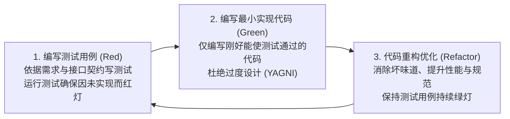
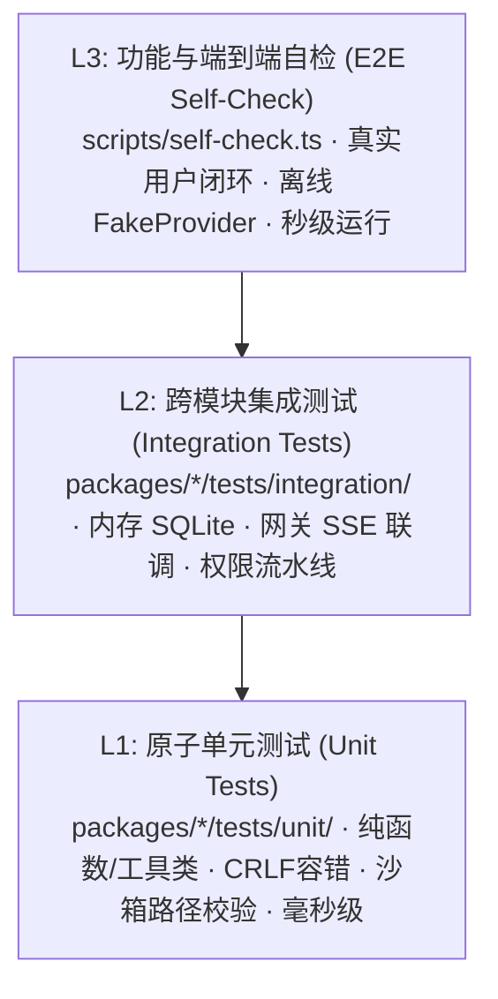

# 测试与质量验收规范 (TDD 敏捷严密版)

> 文档标识：`docs/规范/测试规范.md`  
> 归属规范：项目工程质量红线规范  
> 核心原则：**坚决贯彻测试驱动开发 (Test-Driven Development, TDD) 思想**。在业务代码动工之前，测试用例必须先行落盘；每一次版本提交前，必须通过三层分层测试；**最终交付与验收标准，严格以自动化测试用例全量通过为唯一客观准绳**。

---

## 1. 敏捷 TDD（测试驱动开发）工作流铁律

所有功能模块、工具算法与业务逻辑的开发，必须严格遵循标准的 TDD 三步循环：



### TDD 行为准则
1. **测试用例先行**：在创建或修改 `src/*.ts` 业务实现之前，必须先在 `tests/*.test.ts` 中编写对应的失败测例（Red）；
2. **严禁无测开工**：严禁提交未配对应测例的业务实现代码；
3. **验收唯一准绳**：所有原子工作包（WBS Work Package）的完成标记，**必须以对应的自动化测试用例 100% 绿灯通过作为最终验收依据**。

---

## 2. 零 Native 极简测试技术栈

- **测试运行器**：严格使用 Node 22 原生内置标准库 `node:test` 与 `node:assert/strict`；
- **零外部测试框架**：绝对禁止引入 Jest、Vitest、Mocha、Chai 等重型第三方测试框架，杜绝 `node-gyp` 原生依赖风险与臃肿配置；
- **执行命令**：
  ```bash
  pnpm test              # 运行所有 packages 和 apps 下的自动化测试
  node --test tests/*.test.js  # 单模块快速运行
  ```

---

## 3. 三层分层测试体系 (Layered Testing)

为保障研发质量与测试执行速度的最佳平衡，测试划分为三个严格层次：



### 3.1 L1 原子单元测试 (Unit Testing)
- **目标**：验证独立的原子函数、算法边界与数据结构；
- **涵盖重点**：
  - 文件工具换行符容错算法（CRLF vs LF 字符串替换）；
  - 沙箱绝对路径防逃逸守卫（`fs.realpathSync` 拦截符号链接）；
  - Windows Shell 探测降级链与命令参数构建；
  - 代理分流调度逻辑（`undici.EnvHttpProxyAgent` 白名单判定）；
  - BPMN 2.0 XML 标签轻量解析 AST 结构。
- **性能指标**：单个测试文件执行耗时 < 100ms，无网络与文件系统副作用。

### 3.2 L2 跨模块集成测试 (Integration Testing)
- **目标**：验证插件与内核、存储与调度器、权限与工具之间的契约流转；
- **涵盖重点**：
  - 追加式事件日志表 (`events`) 单调连续自增 `seq` 序号与事务一致性；
  - 超长输出触发 Spill 机制自动转存会话私有目录；
  - 权限决策流水线拦截（Deny > Ask > Allow）与异步审批状态流转；
  - 单回合 Git Checkpoint 快照捕获、未提交手写代码隔离与 `Revert Turn` 原子复原；
  - 父子工作区写锁租约让渡（Parent-Child Lock Delegation）与防死锁测试。
- **数据策略**：使用 `:memory:` 内存模式 SQLite，不污染磁盘物理数据。

### 3.3 L3 功能与端到端自检 (E2E & Functional Testing)
- **目标**：模拟真实工程师的完整会话生命周期，作为发布与提交前的最终质量大门；
- **核心载体**：`scripts/self-check.ts`；
- **执行闭环**：
  1. 启动轻量服务实例，加载单实例锁与数据库；
  2. 模拟用户创建绑定本地工作区的会话；
  3. 基于内置 `FakeProvider` 模拟流式打字机输出与思考链（Reasoning）；
  4. 触发 Agent 调用 `read_file` 观察，调用 `edit_file` 精确替换，调用 `bash` 运行测试；
  5. 模拟用户点击【撤销本回合修改 (Revert Turn)】并验证工作区 100% 恢复；
  6. 模拟长会话触发基于 Epoch/Seq 边界的无上限滚动压缩；
- **性能与网络指标**：**纯离线运行，零真实 API Key 消耗，全流程耗时严格 < 5 秒**。

---

## 4. 提交前质量门槛与门禁流水线 (Commit Gates)

在执行任何 Git 提交（Commit）或 Sprint 结项前，必须本地执行并严格通过以下命令组合：

```bash
pnpm check
```

该命令由 `package.json` 编排并顺序执行以下三道关卡，任意一项失败立即中止：
1. **Lint 检查 (`pnpm lint`)**：ESLint 语法与代码风格检查，零 error，零 warning；
2. **类型检查 (`pnpm typecheck`)**：`tsc --noEmit` 全量 TypeScript 严格类型检查，严禁任何隐式 `any`；
3. **分层测试 (`pnpm test`)**：运行全部 L1 单元测试与 L2 集成测试，断言通过率必须为 **100%**；
4. **集成自检 (`node scripts/self-check.ts`)**：全链路端到端闭环自检，退出码必须为 `0`。

---

## 5. 敏捷 Sprint Demo 业务演示与验收评审规约

在每个 Sprint 宣布完成前，必须由开发团队进行**端到端真实业务演示（Sprint Review Demo）**：
1. **真实拉起**：在对应操作系统中运行 `scripts/start-dev.ps1` (Win32) 或 `scripts/start-dev.sh` (POSIX)，浏览器自动打开进入 Web 控制台；
2. **场景走查**：严格按照《02-项目开发计划说明书》中该 Sprint 承诺的可演示业务功能（如 Sprint 1 的 Provider 现场探测与代理开关、Sprint 2 的对话与 Revert Turn 撤销）进行真实人机交互演示；
3. **测例核验**：对照《03-系统测试用例说明书》，确认该 Sprint 范围内的所有 TC-ID 自动化测例均在 CI/CD 中通过，并将 RTM 矩阵状态点亮为 `✅ 已通过 (Passed)`。任何存在人工未跑通缺陷的特性，严禁结项发布。

---

## 6. 测试数据与安全红线

- **严禁泄漏密钥**：测试代码或 Fixture 中绝不写入任何真实 API Key、Token 或密码；
- **测试隔离性**：集成测试生成的文件必须在临时目录（如系统的 `os.tmpdir()` 或专用的测试沙箱目录）中执行，测试完毕必须在 `after()` 钩子中原子清空，绝不污染项目根目录；
- **确定性 Mock**：对大模型响应与系统时间全部通过受控的 Fake 实现，杜绝因外部网络波动导致测例偶发失败（Flaky Tests）。
