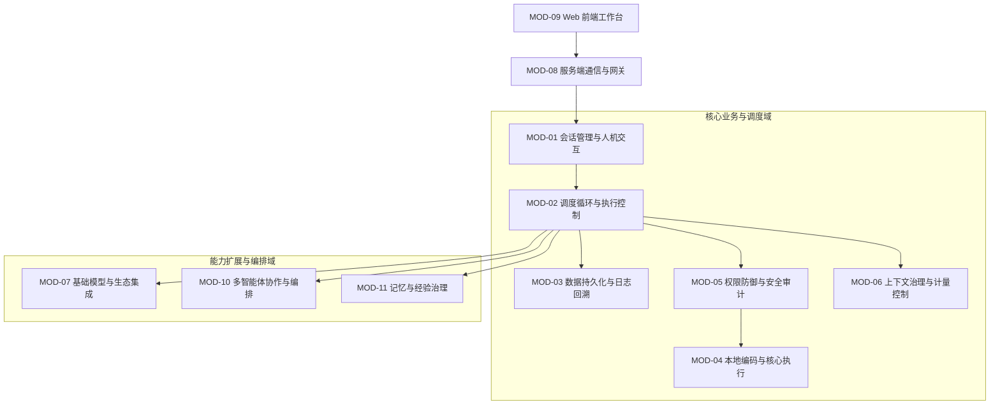

# Agent Harness 功能模块需求规格说明书

> 文档标识：`docs/阶段-1-需求/功能模块需求规格说明书.md`  
> 归属阶段：生命周期阶段-1-需求  
> 目标读者：产品经理、业务分析师、前端/后端工程师、测试工程师  
> 编写规范：**纯业务功能视角阐述**。明确阐明系统各个功能模块是“用来干嘛的”，严禁堆砌数据库 DDL 与编程实现代码。

---

## 1. 产品总体功能全景

Agent Harness 是一款面向软件工程研发全生命周期的编码 Agent 运行时与现代化 Web 管理工作台。系统由 **11 个核心业务功能模块** 协同组成，共同驱动从需求分析、代码修改、自动化测试到版本库提交的端到端可验证闭环：

---

## 2. 功能模块详细业务规格

---

### MOD-01：会话管理与人机交互模块 (Session & Interaction)

#### 1. 模块定位与业务目标
作为开发者与智能体打交道的核心业务中枢。负责管理研发任务的完整生命周期，维护会话与本地代码仓库的物理绑定，承载消息交互与实时状态呈现。

#### 2. 核心功能清单与业务描述
- **F1.1 工作区物理锁定与强绑定**：
  - **功能描述**：开发者新建会话时必须显式选择目标代码仓库的物理路径（如 `G:\Projects\auth-service`）。会话一旦创建，该路径在整个生命周期内物理只读锁定，禁止中途篡改；
  - **业务目的**：为 Agent 的一切读写命令锚定唯一安全根目录，杜绝代码串项目误写。
- **F1.2 现代化会话流式交互**：
  - **功能描述**：支持打字机式流式消费模型输出，将大模型的深度思考链（Reasoning）与最终文本回答分离，思维链默认折叠展示，并提供一键复制与 Markdown 代码高亮渲染；
  - **思维链上下文治理 (Reasoning Token Pruning)**：单回合内部支持实时查看思考推演，但在回合结束组装下一轮历史上下文时，默认剥离/折叠历史推理内容，仅持久化于底层供人类追溯，杜绝指数级消耗窗口与高昂资费；
  - **异常防护**：渲染引擎强制挂载 XSS 消毒滤网，防止第三方输出或网页抓取内容注入恶意前端脚本。
- **F1.3 显式打断终止 (Abort)**：
  - **功能描述**：在 Agent 思考、生成长文本或执行耗时测试命令过程中，顶栏与输入框常驻高亮【中止 (Abort)】操作；
  - **业务效果**：人类点击打断后，系统干净硬杀底层的网络连接与正在执行的子进程，保留已产出的前置内容并标记为中断，允许人类在此基础上原地补充新指令继续。
- **F1.4 单回合原子回滚 (Revert Turn - 开发者的后悔药)**：
  - **功能描述**：在涉及物理代码写入的回合开始前，系统自动捕获工作区 Git 检查点（Checkpoint）；
  - **业务效果**：若 Agent 连续修改多个文件后跑测试失败、代码方向彻底跑偏或开发者对手改结果不满意，工作台提供一键【撤销本回合修改 (Revert Turn)】按钮，底层执行原子复原，一秒恢复至本回合开始前的干净工作区。
- **F1.5 流式中断断点恢复交互**：
  - **功能描述**：若因外部网络偶发抖动导致大模型吐出一半代码后连接被掐断，系统完整保留已接收到的半截文字并在界面给出断点标识，提供【从断点继续】与【整轮重新生成】操作，人类无需手动重新打字。
- **F1.6 首次启动极速破冰向导 (Welcome Wizard)**：
  - **功能描述**：当新安装系统首次打开且数据库处于空配置状态时，自动弹出轻量两步就绪卡片（接入首个模型 API Key + 点选首个本地项目目录），1 分钟内完成端到端破冰，随后自动平滑进入主工作台。

---

### MOD-02：调度循环与执行控制模块 (Agent Loop & Scheduling)

#### 1. 模块定位与业务目标
系统的“决策与行动大脑”。负责驱动大模型按照 ReAct（思考-行动-观察）范式开展多轮自主排查与代码修复，并对执行步数和死循环提供严格的安全熔断保护。

#### 2. 核心功能清单与业务描述
- **F2.1 ReAct 确定性调度大循环**：
  - **功能描述**：主调度器协调每轮输入组装、模型推理、工具解析与结果回灌。模型输出文字则正常展示，模型返回工具调用则经过安全层判定后交由本地执行，产物作为环境观察事实回灌模型展开下一轮思考；
  - **业务目的**：实现真正的“看代码 &rarr; 查报错 &rarr; 改代码 &rarr; 跑测试”全自主闭环。
- **F2.2 单回合预算与步数硬限**：
  - **功能描述**：单次回合设置硬性最大迭代步数限制（默认最大 25 步）；
  - **业务目的**：防止复杂任务或较弱模型在找不到答案时无限自我调用工具，在第 25 步强制收敛停机并向人类汇报当前进展，杜绝意外烧钱。
- **F2.3 代码修改 3 次失败熔断保护**：
  - **功能描述**：在编辑某一代码文件时，若因行定位或上下文变动导致连续 3 次替换失败，调度器强制触发熔断刹车，暂停当前回合的自动重试，向人类弹出告警卡片请求人工确认或提示输入；
  - **业务目的**：彻底阻断模型陷入“匹配失败 &rarr; 盲目再试 &rarr; 再次失败”的死循环空转。

---

### MOD-03：数据持久化与日志回溯模块 (Persistence & Event Sourcing)

#### 1. 模块定位与业务目标
全系统的数据基石与审计中心。负责将系统的所有历史事实、请求上下文与执行产物进行不可变落盘，提供毫秒级全文检索与历史状态重现。

#### 2. 核心功能清单与业务描述
- **F3.1 追加式事件日志唯一事实源 (Event Sourcing)**：
  - **功能描述**：系统废除直接修改历史数据的做法，用户发问、模型请求快照、工具调用与结果均作为唯一事件单调递增追加写入；
  - **业务价值**：界面上的消息树、任务卡片全是由日志事实物化计算呈现，历史记录具备法律级不可篡改性。
- **F3.2 任意历史时刻确定性重放 (Replay)**：
  - **功能描述**：支持调取任意历史回合或步骤，纯函数还原大模型在当时的完整输入与思考环境，方便开发者复盘 Agent 的思考决策链路。
- **F3.3 会话分支分叉探索 (Fork)**：
  - **功能描述**：开发者可以在事件轨迹视图中，选择以往的任意一个步骤点击【分叉】，系统以此为基点拉出全新分支会话，允许尝试另一种完全不同的重构技术路线。
- **F3.4 全文毫秒级检索 (FTS)**：
  - **功能描述**：利用原生内置的全文倒排检索引擎，支持在数以万计的历史提问、代码修改片段与命令输出中，瞬间检索命中目标知识点。
- **F3.5 大文本溢出落盘机制与私有隔离清理 (Spill Blobs - D68)**：
  - **功能描述**：当终端打印日志或抓取网页正文超过预算（如大于 50KB）时，系统自动将正文存入外部独立寻址，主数据库与模型上下文仅保留前序摘要与物理引用；
  - **私有隔离与生命周期绑定**：Spill 文件保存在会话私有子目录（`~/.harness/sessions/<id>/blobs/`），会话被用户删除时底层原子递归清空该私有目录，无全局死锁风险，零孤儿垃圾文件；
  - **业务目的**：保障数据库轻盈高效，杜绝超长大输出把模型上下文撑爆，同时保持磁盘绝对干净。
- **F3.6 单实例文件锁与防争抢保护 (D65)**：
  - **功能描述**：系统启动时向数据目录写入进程锁文件（`~/.harness/.lock`），记录主进程 PID 与监听端口；
  - **业务效果**：若检测到已有另一个 Harness 实例正在运行，立即安全阻断并提示已有端口或引导指定独立目录，从根源杜绝双进程并发争抢 SQLite WAL 导致的 `SQLITE_BUSY` 锁库冲突。

---

### MOD-04：本地编码与核心执行模块 (Tools & Execution)

#### 1. 模块定位与业务目标
智能体与开发者本地操作系统打交道的“双手”。提供精密的本地文件读写、工程级代码搜索、持久化终端运行以及人机澄清交互工具。

#### 2. 核心功能清单与业务描述
- **F4.1 先读后写的原子文件修改 (Atomic Edit)**：
  - **功能描述**：模型执行代码修改前，目标文件必须在当前会话已被查看过；修改操作采用精确原文字符串替换。若匹配不到或匹配多处，抛出清晰行号定位；
  - **换行符容错与模糊归一化**：吸收 OpenCode 经验，针对 Windows CRLF 与 Linux LF 混用场景自动统一换行符比对，防止因换行符差异导致 `oldString not found` 误报；
  - **外部修改防卫**：执行修改前强制校验文件物理修改时间与内容指纹。若检测到人类在外部编辑器中改动了该文件，系统坚决拒绝盲目覆盖，自动重读最新版本提示模型刷新上下文，界面同时给出警告劝阻人类并发手改。
- **F4.2 工程级文件查找与防黑洞过滤**：
  - **功能描述**：提供路径通配 (`glob`) 与正则关键词搜索 (`grep`)；
  - **防黑洞规则**：默认强制跳过 `node_modules`、`.git`、`dist`、`build`、`.next` 等巨型目录，且单次文件搜索结果硬卡 200 条上限，超出部分自动截断并提示缩小范围，防止系统内存暴涨。
- **F4.3 沙箱绝对路径防逃逸**：
  - **功能描述**：所有文件操作在执行前，必须将其解析为物理绝对路径；
  - **防逃逸契约**：严格检查解析后的真实物理路径是否仍然处于绑定的工作区根目录下，彻底拦截符号链接 (Symlink) 穿透越界读取宿主系统敏感文件。
- **F4.4 持久化终端与跨平台防假死运行机制 (Persistent Shell - Q2)**：
  - **功能描述**：为每个会话维持长驻终端解释器，支持前后命令环境变量延续与目录状态保持；支持启动开发服务器等后台长任务并实时捕获输出流；
  - **Windows Shell 探测降级链**：优先探测 `pwsh.exe`，降级至 `powershell.exe`，最终降级至 `cmd.exe`；
  - **权限策略自动绕过**：针对 PowerShell 强制注入 `-NoLogo -NoProfile -NonInteractive -ExecutionPolicy Bypass`，彻底消除企业策略限制导致的脚本执行失败；
  - **非交互与硬超时**：默认注入非交互环境变量（如 `CI=true`），防止命令卡死在确认提示中；单条命令硬设 120 秒超时拦截，超时自动下发 Windows `taskkill /T /F` 或 Unix 进程组强制终结，杜绝任务与僵尸子进程假死挂起。
- **F4.5 敏感凭据自动脱敏防护**：
  - **功能描述**：命令打印的日志在落盘与回灌模型前，底层自动执行常见 API Key 与密码正则过滤，自动替换为 `[REDACTED]` 标签，杜绝密钥泄密。
- **F4.6 结构化人机澄清提问 (ask_user - Q8)**：
  - **功能描述**：当业务规则不明确时，Agent 主动发起包含选项的提问卡片等待人类点选，避免盲目猜测；
  - **独立 Request ID 与双轨交互**：每次提问赋予独立 `que_<uuid>` 标识，前端支持【提交回答】与【驳回/忽略】双轨端点交互；
  - **断线无损恢复**：提问状态持久化保存，人类关掉浏览器休眠数小时后重新打开，卡片依然完好停留在原处等待输入，状态不丢。
- **F4.7 外部 MCP 工具命名空间强隔离 (Q9)**：
  - **功能描述**：所有外部接入的 MCP 工具在注册与暴露给大模型时，强制自动附加 `mcp__<server>__<tool>` 命名空间前缀；
  - **核心保留字保护**：系统内置的 6 大核心本地编码工具（`read_file`, `edit_file`, `write_file`, `glob`, `grep`, `bash`）名称由内核绝对独占，外部 MCP 严禁注册同名工具，从协议根源杜绝本地沙箱被劣质或恶意 MCP 劫持。

---

### MOD-05：权限防御与安全审计模块 (Permissions & Sandboxing)

#### 1. 模块定位与业务目标
系统的“安全闸门”。贯彻默认安全与 Fail-Closed 原则，严格限制智能体在本地环境中的破坏性操作，提供红绿 Diff 代码审阅与人类确认机制。

#### 2. 核心功能清单与业务描述
- **F5.1 权限规则流水线 (Deny > Ask > Allow)**：
  - **功能描述**：每次工具执行前依次求值：黑名单规则命中立即强行拒绝；危险操作规则命中则拦截进入人工审批；仅有匹配白名单或安全操作方可自动放行。
- **F5.2 差异化权限三级预设**：
  - **只读模式 (Read-only)**：所有改代码、写文件、执行 Shell 操作全部拒绝，仅允许看代码，适合新手初次排查；
  - **标准开发模式 (Edit · 默认推荐)**：允许日常读文件与常规排查命令，写代码与高危命令触发弹窗审批；
  - **全权受托模式 (Full)**：非破坏性操作全部免审快速执行，仅受工作区沙箱保护。
- **F5.3 人机高危审批与 Diff 统一审阅**：
  - **功能描述**：当改动核心配置或执行破坏性脚本时弹出审批弹窗。针对代码改动自动生成标准的红绿颜色行级 Diff 对比；针对终端命令明确呈现完整执行脚本与目录；
  - **授权选项**：提供【单次批准放行】、【本会话始终允许该动作】与【直接拒绝并反馈修改意见】。
- **F5.4 版本控制安全红线**：
  - **功能描述**：任务完成后 Agent 仅负责生成规范的提交信息草稿供人类预览；代码提交（`git commit`）必须经过人类审批确认；**系统严格禁止 Agent 在任何模式下自主静默执行 `git push` 将代码推向远端仓库**。

---

### MOD-06：上下文治理与计量控制模块 (Context Governance)

#### 1. 模块定位与业务目标
大模型对话窗口与使用成本的“节流阀与监控台”。负责精准计量 Token 消耗与费用折算，感知不同模型窗口物理上限，提供无损滑动窗口压缩。

#### 2. 核心功能清单与业务描述
- **F6.1 实时 Token 计费与费用换算**：
  - **功能描述**：发送前快速估算消耗，回包后依据模型返回的真实统计数据校正入库；结合配置的模型单价，在顶栏实时跳动显示当前会话消耗的 Token 总量与折算美元金额。
- **F6.2 物理窗口动态感知与压缩阈值联动**：
  - **功能描述**：支持精确感知并配置当前模型的实际物理窗口尺寸（如 16k/64k/128k/192k/200k 等）；
  - **联动机制**：系统的压缩警戒水位线严格动态绑定为当前模型生效物理上限的 80%，换用小窗口模型及时收拢防爆卡，换用大窗口模型充分释放长文理解能力。
- **F6.3 基于 Epoch/Seq 边界的无上限滑动滚动压缩 (Compaction - D50, Q7)**：
  - **功能描述**：吸收 OpenCode `SessionCompaction` 机制，废除固定压缩次数死限；
  - **切片基线锁定**：压缩产生独立 `compaction` 事件帧入库，活跃消息重构直接以最新 `compaction.seq` 为起点，前序旧消息不再参与组装；
  - **滚动摘要与尾部保留**：多轮压缩时合并前序摘要，同时铁律保护最近 3 轮交互与未闭合工具调用不被压缩；
  - **溢出紧急自动恢复 (`compactAfterOverflow`)**：若大模型调用意外抛出超长硬拦截报错，系统自动就地压缩并原地重发请求，杜绝会话报错中断；
  - **生命周期解耦**：压缩仅释放当前会话空间，绝不向长期记忆库写入半成品经验。
- **F6.4 全局偏好与项目规约双层级联装配 (D67, Q10)**：
  - **功能描述**：对齐 OpenCode `instruction-context.ts`，自动向上回溯扫描：
    1. 全局层：读取系统主目录 `~/.harness/AGENTS.md`，注入通用的工程师个人偏好；
    2. 项目专属层：探测当前工作区 `<workspace>/AGENTS.md`，注入当前仓库专属架构铁律；
  - **去重合并**：按来源绝对路径标注并执行合并注入，既杜绝跨项目语言/技术栈污染，又免去跨仓库重复调教。

---

### MOD-07：基础模型与生态集成模块 (Models & Ecosystem)

#### 1. 模块定位与业务目标
连接各种云端商用模型、本地私有化模型以及外部第三方工具生态的适配门户。

#### 2. 核心功能清单与业务描述
- **F7.1 统一 OpenAI / Anthropic 双轨协议端点接入**：
  - **功能描述**：支持配置接入任何兼容 OpenAI 标准规范（`/v1/chat/completions`）或 Anthropic 原生规范（`/v1/messages`）的商用与本地模型；
  - **厂商协议自适应**：在 Provider 配置中显式单选接口协议类型，Anthropic 原生协议模式下自动支持提示词缓存 (Prompt Caching) 与原生思考块 (Thinking Block) 协同，避免粗暴转译带来的能力损耗；支持运行时在顶栏秒级切换。
- **F7.2 模型列表动态探测与拉取**：
  - **功能描述**：在 Provider 配置界面填入 BaseURL 与 Key 后，提供独立的【获取模型列表 (GET /models)】按钮，现场握手探测并自动拉取后端可用模型清单填充进选择下拉框。
- **F7.3 两级网络代理调度体系与僵死熔断 (Global & Provider Proxy - D60, D63)**：
  - **功能描述**：提供兼顾海外访问与本地直连的两级网络代理分流机制：
    - **系统全局代理**：在系统设置中配置，全量外发网络请求（依赖拉取、公网扩展等）统一走代理；
    - **Provider 专属代理**：在 Provider 配置弹窗中支持「强制直连」、「继承全局代理」与「独立自定义代理」三级设定，弹窗内设独立代理开关；
    - **卡片快捷开关**：在已配置 Provider 资产列表卡片中常驻【是否开启代理】Toggle 开关，支持秒级切换直连与代理状态；
    - **白名单绕过**：支持配置 `NO_PROXY` 绕过名单（默认排除 `localhost`, `127.0.0.1`, `::1`），防止本地 Ollama 或局域网 MCP 被错误转发；
    - **网络静默僵死熔断**：代理网络下首包 30s + Chunk 静默 45s 硬超时熔断挂起，通知用户排查代理，严禁静默降级直连。
- **F7.4 通用 Agent Skills 技能包管理**：
  - **功能描述**：严格对齐业界标准（YAML Front-matter + Markdown），支持以标准原子目录格式加载扩展技能；
  - **渐进披露机制**：系统提示仅注入轻量 Name 与意图描述，模型命中触发词后主动调用 `skill(name)` 动态加载正文规约，实现零上下文负担；
  - **本地导入向导**：支持输入本地目录路径一键校验合规性并导入为项目专属或全局技能。
- **F7.5 标准 MCP 外部服务连接池与命名空间隔离 (Q9)**：
  - **功能描述**：作为标准 Model Context Protocol 客户端，支持挂载本地进程与远端 HTTP 外部服务（如 GitHub、数据库），自动发现扩展工具集；
  - **命名空间强隔离**：所有外部 MCP 工具统一强制加上 `mcp__<server>__<tool>` 前缀，本地核心工具名称绝对保留，杜绝沙箱劫持；
  - **故障隔离机制**：外部 MCP 服务若发生连接失败或单次调用超时，系统立即局部降级隔离，绝不影响本地核心文件与编码工具的正常运转。

---

### MOD-08：服务端通信与网关调度模块 (Server & Gateway)

#### 1. 模块定位与业务目标
系统的前后端通信枢纽与网络安全第一道大门。负责高效的消息调度、流式事件分发、断线续传保障以及工作区独占写锁调度。

#### 2. 核心功能清单与业务描述
- **F8.1 工作区并发控制与写锁租约让渡 (D42, D64)**：
  - **功能描述**：同一物理代码库在任意时刻只允许单个当前活动会话持有物理写锁（执行修改文件、运行测试、写版本库）；
  - **父子租约让渡 (Parent-Child Lock Delegation)**：多智能体协作或子任务派发时，子 Agent 继承父会话写锁租约（`rootSessionId`），子执行期间父挂起，子完成原路归还，彻底消除父子死锁；
  - **读写分级流转**：纯只读指令完全放行共享；遇到并发写冲突调度层原生挂起等待，前端给出倒计时与【中断冲突】操作。
- **F8.2 Server-Sent Events (SSE) 增量续传与休眠心跳重连 (D69)**：
  - **功能描述**：建立高效单向事件流通道；携带 `?after=<seq>` 增量补齐；
  - **服务端 15s 心跳**：服务端定时下发心跳保活帧；
  - **息屏与休眠感知重连**：客户端监听 `visibilitychange`，检测到切回前台或连续 30s 未收到心跳自动判定半开断链，携带最新 seq 秒级重连拉齐，彻底消解假死假象。
- **F8.3 外网暴露与访问安全口令防护**：
  - **功能描述**：默认仅监听本机回环地址免密使用；若开发者配置为监听局域网或公网地址，服务端强制拦截校验安全令牌，未设置拒绝启动，所有外部请求必须携带合法令牌。

---

### MOD-09：Web 前端应用模块 (Web Console)

#### 1. 模块定位与业务目标
面向专业软件工程师的高信息密度、代码友好、暗色调优先的沉浸式现代化工作台。

#### 2. 核心功能清单与业务描述
- **F9.1 顶级工作台与设置中心双态架构**：
  - **工作台 (Run)**：聚焦会话对话、角色流水线看板、BPMN 流程追踪、持久终端与轨迹审计；
  - **设置中心 (Config)**：聚焦工作区资产管理、记忆治理、模型配置、知识库中心、流水线模板、MCP 扩展与系统全局设置。
- **F9.2 物理工作区常驻显式高亮**：
  - **功能描述**：顶栏显眼位置固定呈现当前绑定的物理绝对路径（带锁定图标），直观展示当前会话归属的代码仓库上下文。
- **F9.3 任务进度与 Todo 看板联动**：
  - **功能描述**：将 Agent 拆解的复杂多步骤任务转化为可视化的 Todo 任务进度卡片，实时呈现哪一步在排查、哪一步在改代码、哪一步已完成。

---

### MOD-10：多智能体协作与流水线编排模块 (Multi-Agent Orchestration)

#### 1. 模块定位与业务目标
为不同复杂度的研发场景提供三种形态的多智能体自动化协同能力：子任务委派、角色流水线与 BPMN 业务工作流。

#### 2. 核心功能清单与业务描述
- **F10.1 场景 B：会话级子任务委派 (Subagents)**：
  - **功能描述**：在主对话工作台底部勾选「开启子任务委派」，主 Agent 在遇到复杂子模块调查时，自动唤醒隔离的子 Agent 执行深度排查；
  - **业务效果**：子 Agent 生命周期独立，其执行过程不污染主会话消息流，跑完后将精炼产物回传主 Agent 继续决策。
- **F10.2 场景 A：多角色协同流水线 (Role Pipeline)**：
  - **功能描述**：围绕标准化交付固化阶段泳道（`需求 PRD` &rarr; `架构设计` &rarr; `TDD 编码` &rarr; `QA 验收`），支持各阶段定制负责角色与模型；
  - **上游审定基线只读保护**：上游阶段经审批门放行后的交付工件，在后续所有下游角色中强制设为**只读保护状态**，严禁下游篡改上游基线；
  - **独立工作台**：提供任务列表大屏、步骤定制工作台与独立任务执行工作台（含工作区锁定与人机指令对话流）。
- **F10.3 场景 C：BPMN 2.0 业务工作流引擎 (BPMN Workflow)**：
  - **功能描述**：原生支持导入与流转标准 BPMN 2.0 XML 业务流程模型；
  - **现代 Dify 风格编排画板 (`config-workflow-design.html`)**：
    - 左侧节点物料库与右侧参数检查器支持**一键无缝折叠**，折叠后中央无限点阵画布获得 **100% 满屏无遮挡全景视野**；
    - 右侧检查器支持输入变量消费、双轨 Prompt（人设规约与任务模板分离）、全局输出变量映射与排他网关分支表达式在线求值沙盒；
  - **实例监控与人工干预**：提供动态 SVG 节点流转高亮、实时变量总线查看与人工介入对话流。

---

### MOD-11：记忆与经验治理模块 (Memory & Reflection Console)

#### 1. 模块定位与业务目标
解决大模型在跨任务或开启新会话时“容易失忆、容易重复踩同一个坑”的痛点，构建工作区专属的长期经验沉淀与召回中心。

#### 2. 核心功能清单与业务描述
- **F11.1 反思沉淀模式按需切换**：
  - **全自动模式**：任务或会话圆满结束时，后台静默调度轻量反思模型提炼踩坑经验直接入库，零打扰；
  - **半自动审核模式**：提炼的经验条目先进入待审核队列，由工程师在控制台中直观对比原文与提取项后勾选批准，防止模型幻觉污染认知。
- **F11.2 四大多样化存储介质治理（工作区独立配置）**：
  - ⚪ **未启用 (Disabled)**：完全不记录、不反思、不注入，适用于保密沙箱或临时验证脚本；
  - 📄 **纯 Markdown 文件模式**：落盘在 `.harness/memory.md`，人类直观可读可改，随代码库一同 Git 提交协同；
  - 🔵 **本地嵌入式 SQLite 模式**：基于原生 `node:sqlite`（零 Native），支持自定义相对或绝对路径，集成 FTS5 全文索引实现毫秒级关键词检索；
  - 🟣 **Markdown 文件 + 向量双轨模式**：以 `.harness/memory.md` 为真相源，挂载本地 Embedding 模型计算切片向量，兼备版本化管理与语义联想切片召回。
- **F11.3 存储介质受控变更与迁移向导**：
  - **只读详情锁定**：主界面工作区存储卡片默认以只读详情呈现，杜绝随意切换破坏数据；
  - **两极诉求安全分流**：
    - **诉求 A：全新起步，丢弃测试数据**：适用于初期调试产生的数据，不执行迁移直接新建空白介质，原文件自动更名为 `.bak` 冷归档备份，永不丢失；
    - **诉求 B：平滑数据无损迁移**：适用于生产项目已积累宝贵经验，在原子事务中逐条解析并按 SHA-256 内容指纹去重写入新介质，确保经验无缝传承。
  - **动态参数配置**：向导内部根据所选新介质，动态展开该模式专属参数表单现场设定，同时卡片常驻【修改参数】按钮支持在不换介质时微调配置。

---

## 3. 业务需求总结

本功能模块需求规格说明书清晰定义了 Agent Harness 的业务边界与所有功能特性的输入输出预期。所有关于底层物理表结构（DDL）、TypeScript 接口声明与 REST/SSE 通信报文的实现细节，严格由阶段 2 的设计说明书负责承接，保证各生命周期阶段文档职责清晰、互不越界。
