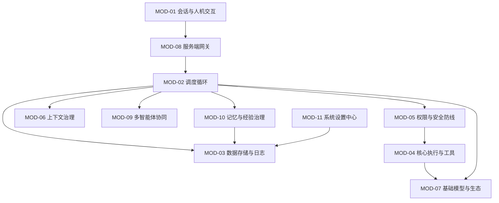
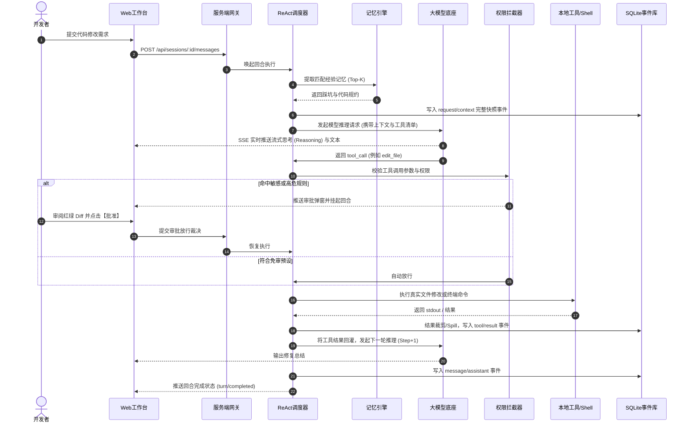
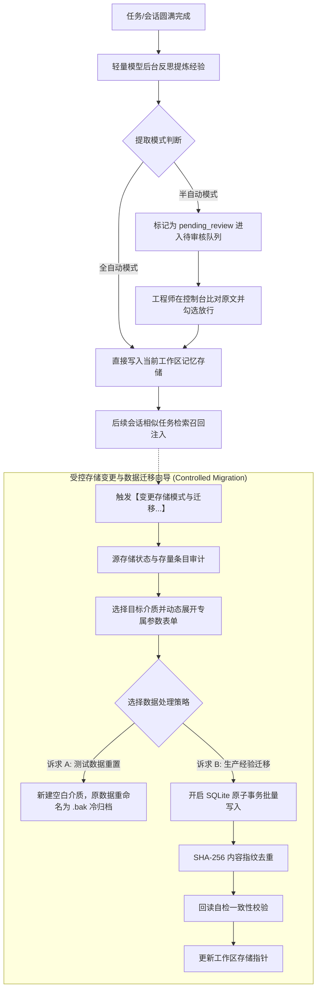

# Agent Harness 概要设计说明书

> 文档标识：`docs/阶段-2-设计/01-概要设计说明书.md`  
> 归属阶段：生命周期阶段-2-设计  
> 前置依赖：`docs/阶段-1-需求/功能模块需求规格说明书.md`、`CONTEXT.md` (D1–D41)  
> 目标读者：架构师、开发工程师、评审人员

---

## 1. 系统建设目标与定位

Agent Harness 是一款面向中高级软件研发团队与独立工程师的**自主可控、零本地 C++ 编译依赖、以编码任务闭环为核心**的 Agent 运行时系统与管理工作台。

系统首要业务场景是接管完整的工程研发闭环：
`代码缺陷分析` &rarr; `定位与复现` &rarr; `编写失败测试(TDD)` &rarr; `最小化修改实现` &rarr; `测试跑通验证` &rarr; `生成代码变更差异(Diff)` &rarr; `安全人机审批` &rarr; `提交版本库(Commit/PR)`。

系统以轻量、透明、自愈和高安全性为底层准则，不引入黑盒复杂抽象，支持开发者自由插拔大模型底座与本地开发工具链。

---

## 2. 总体架构设计原则

1. **零 Native 原生编译约束 (Zero Native Addon)**：
   全系统运行在 Node.js 22+ 平台之上，严格禁止任何依赖 `node-gyp`、Visual Studio C++ 或 Python 构建链的原生包。数据库统一采用 Node.js 原生内置的 `node:sqlite`（DatabaseSync 引擎），终端调用统一使用内置 `node:child_process` 管道。
2. **唯一事实真相驱动 (Event Sourcing)**：
   会话所有交互、模型输入上下文快照、工具执行产物与打断事件，均以单调递增的不可变追加事件流存储。消息列表、运行看板均是由事件流实时计算物化的只读视图，从根源杜绝数据断章与幻觉篡改。
3. **物理工作区锁定防越界 (Workspace Sandboxing & Pinning)**：
   会话在创建初始必须显式绑定物理文件目录，并在整个生命周期内物理只读锁定。所有文件查找、代码读写与脚本执行均受到根路径沙箱安全守卫，严禁跨项目越界读写。
4. **渐进式披露与 Token 节俭 (Token Efficiency & Progressive Disclosure)**：
   系统提示词不一股脑倾倒全部技能或规则正文，冷态时仅注入轻量标识与意图摘要。当模型判断需要特定能力时，由运行时在热态阶段动态调取正文，避免上下文暴涨与经济浪费。
5. **底层平台韧性与分流调度 (Platform Resilience & Traffic Routing - D60, D62)**：
   底层操作系统适配（Windows Shell 探测、换行符容错、`taskkill` 进程树硬杀）深度吸收工业级开源实践；网络层提供两级代理分流（系统全局 + Provider 专属）与死链熔断，确保在复杂企业内网与科学上网环境下零假死运行。

---

## 3. 软件总体逻辑分层体系

系统的整体架构由底至顶划分为五个清晰的逻辑层次：

```mermaid
graph TD
    subgraph Layer5["表现层：Web 现代化交互控制台 (Web Console)"]
        UI_Chat["主会话工作台 (run-chat)"]
        UI_Pipeline["角色流水线看板 (run-pipeline)"]
        UI_Workflow["BPMN 流程设计器 (config-workflow-design)"]
        UI_Terminal["终端长任务 (run-terminal)"]
        UI_Trajectory["事件轨迹审计 (run-trajectory)"]
        UI_Assets["资产管理 (工作区/记忆/模型/知识/技能)"]
        UI_Settings["系统设置中心 (config-settings)"]
        UI_Approval["安全审批弹窗 (approval-modal)"]
    end

    subgraph Layer4["网关层：REST 与 SSE 服务端网关 (API Gateway)"]
        GW_Lifecycle["会话生命周期接入与路由分发"]
        GW_SSE["Server-Sent Events (SSE) 增量流传输 (15s心跳)"]
        GW_Resume["断线无缝补发续传 (?after=seq & visibilitychange)"]
        GW_Lock["单实例进程锁防线 (~/.harness/.lock)"]
        GW_Auth["本地免密与 0.0.0.0 Token 安全鉴权"]
    end

    subgraph Layer3["核心调度与治理层 (Core Runtime & Governor)"]
        RT_AgentLoop["智能体循环调度器 (ReAct Loop)"]
        RT_PipelineRunner["多角色流水线调度器 (Stage Runner)"]
        RT_WorkflowEngine["BPMN 2.0 状态机流程引擎"]
        RT_Governor["上下文治理 (Reasoning剥离 / Spill私有落盘 / 滚动压缩)"]
        RT_LockDelegation["父子工作区写锁租约让渡 (Parent-Child Lock)"]
        RT_GitRollback["单回合 Git Checkpoint 隔离与原子回滚 (Revert Turn)"]
        RT_Permission["安全权限判定拦截器 (Deny > Ask > Allow)"]
        RT_Memory["长期记忆提取与双层级联装配 (Global vs Project)"]
    end

    subgraph Layer2["能力扩展与工具层 (Tools & Integrations)"]
        TOOL_Core["本地核心编码工具集 (保留字独占 / 换行符容错 / taskkill硬杀)"]
        TOOL_MCP["MCP 协议客户端 (强制 mcp__ 命名空间前缀隔离)"]
        TOOL_Skills["通用 Agent Skills 技能加载器 (YAML Front-matter)"]
        TOOL_Models["统一模型适配 Seam (OpenAI Compatible & Anthropic Native 双轨)"]
        TOOL_Proxy["两级网络代理调度器 (undici EnvHttpProxyAgent 分流)"]
    end

    subgraph Layer1["存储与持久化层 (Storage & Persistence)"]
        ST_SQLite["Node 22 原生 SQLite (node:sqlite WAL模式)"]
        ST_Events["追加式事件日志唯一真相库 (Event Log)"]
        ST_FTS["FTS5 全文倒排索引引擎"]
        ST_Blobs["会话私有大文本落盘目录 (~/.harness/sessions/id/blobs/)"]
        ST_Markdown["Git 友好协作文件 (.harness/memory.md)"]
        ST_Settings["系统全局持久化设置字典表 (settings)"]
    end

    Layer5 --> Layer4
    Layer4 --> Layer3
    Layer3 --> Layer2
    Layer3 --> Layer1
    Layer2 --> Layer1
```

---

## 4. 各大功能分块职责与协作关系

系统严格对应产品需求，划分为 **11 个核心业务功能分块**，各分块独立自治且通过清晰的契约协同：

### 4.1 会话管理与人机交互分块 (MOD-01)
- **核心定位**：承载工程师与智能体的交互窗口，负责任务发起、过程监控与状态展示。
- **主要职责**：
  - 维护单会话与物理工作区路径的强绑定关系；
  - 呈现富文本打字流、思维链 (Reasoning) 折叠卡片、红绿代码 Diff 审查与 Todo 任务看板；
  - 提供显式的 Abort 中断打断开关，支持断网重连无感恢复。

### 4.2 智能体循环调度分块 (MOD-02)
- **核心定位**：系统的“大脑调度中枢”，驱动 ReAct（思考-行动-观察）循环。
- **主要职责**：
  - 协调模型推理输入与工具调用分发；
  - 控制单回合最大迭代步数（Step Index），防范死循环与 Token 意外透支；
  - 在接收到打断信号时，干净利落地截断 LLM 请求并下发清理指令。

### 4.3 数据存储与持久化分块 (MOD-03)
- **核心定位**：全系统的数据地基，管理所有结构化数据与事件日志。
- **主要职责**：
  - 驱动 Node 22 原生 SQLite 数据库，配置 WAL 高并发读写模式；
  - 提供单调递增追加式事件写入与分段拉取接口；
  - 驱动 FTS5 倒排索引，为会话历史与经验库提供毫秒级全文查找；
  - 管理大输出落盘机制（Spill），保障主数据库不被超长日志膨胀拖垮。

### 4.4 核心执行与工具分块 (MOD-04)
- **核心定位**：Agent 与宿主操作系统、开发环境打交道的“双手”。
- **主要职责**：
  - 提供受沙箱保护的文件读、写、修改（精准行替换）工具；
  - 驱动持久化后台子进程（Shell），支持实时截获 stdout/stderr 流与 SIGKILL 强杀；
  - 提供 `ask_user` 结构化澄清工具，遇到模糊需求主动向人类提问。

### 4.5 权限拦截与安全防线分块 (MOD-05)
- **核心定位**：守护开发者电脑的“安全闸门”，基于 Fail-Closed 原则。
- **主要职责**：
  - 提供只读 (Read-Only)、标准开发 (Edit)、全权托管 (Full) 三级预设策略；
  - 针对敏感 Shell 命令（如 `rm -rf`）、危险文件路径改写进行参数模式匹配拦截；
  - 协调前端弹出审批确认对话框，仅在人类显式批准后放行。

### 4.6 上下文治理与计量分块 (MOD-06)
- **核心定位**：大模型对话窗口与成本控制的“节流阀”。
- **主要职责**：
  - 实时估算每次请求的 Token 消耗，并在模型回包后以官方 `usage` 校正；
  - 当上下文接近模型物理上限阈值时，自动截取前序历史生成压缩摘要，腾出对话空间；
  - 支持开发者随时手动触发 `/compact` 整理当前对话。

### 4.7 基础模型与生态接入分块 (MOD-07)
- **核心定位**：连接各大 LLM、本地离线模型与外部工具生态的适配层。
- **主要职责**：
  - 统一封装 OpenAI 兼容协议，无缝接入 DeepSeek、Qwen、Ollama、OpenRouter 等端点；
  - 挂载标准 Model Context Protocol (MCP) 客户端，自动发现远端工具；
  - 扫描通用 Agent Skills 规范目录，以渐进披露方式供给高级技能。

### 4.8 服务端通信与网关分块 (MOD-08)
- **核心定位**：前后端解耦的通信枢纽，提供稳定可靠的协议通道。
- **主要职责**：
  - 基于 Fastify 搭建 REST API；
  - 建立标准 Server-Sent Events (SSE) 流式传输通道，并利用内部缓冲区保障 `?after=<seq>` 断点续传；
  - 执行网络监听边界防护（绑定 `0.0.0.0` 时强制安全口令校验）。

### 4.9 多智能体协同与业务流分块 (MOD-09)
- **核心定位**：应对复杂多步骤任务的高级自动化编排引擎。
- **主要职责**：
  - **模式 B（子任务委派）**：主 Agent 通过内置 `spawn_agent` 唤起隔离子 Agent 并回收精炼结论；
  - **模式 A（角色流水线）**：固化“需求&rarr;架构&rarr;编码&rarr;测试”标准化阶段泳道，通过审批门（Gatekeeper）流转交付工件；
  - **模式 C（BPMN 2.0 工作流）**：标准 XML 流程模型解析，排他网关表达式评估，动态流转高亮。

### 4.10 记忆与经验治理分块 (MOD-10)
- **核心定位**：解决 Agent 跨长程任务与跨会话失忆问题的持久认知库。
- **主要职责**：
  - 支持会话完成后的全自动静默提取与半自动待审核队列；
  - 纳管四大存储形态：未启用 (Disabled)、纯 Markdown 文件、本地 SQLite（支持自定义路径）、Markdown+向量双轨模式；
  - 提供严格受控的存储变更向导，支持「丢弃测试数据全新起步」与「平滑数据无损迁移」两极诉求安全分流。

### 4.11 系统设置与基础设施分块 (MOD-11)
- **核心定位**：全系统的全局配置中心与底层运行调优门户。
- **主要职责**：
  - 管理服务监听端口（冲突顺延）、访问令牌与全局数据持久化路径；
  - 管理深色极客、Slate 蓝调、OLED 纯黑等外观主题与等宽代码字体排版；
  - 集中监控内核 10 大插件的加载顺序与 DAG 拓扑健康度。

---

## 5. 核心业务流程流转设计

### 5.1 单回合代码修改闭环时序流转 (Core Turn Flow)

### 5.2 记忆反思与受控迁移生命周期流转 (Memory Lifecycle Flow)

