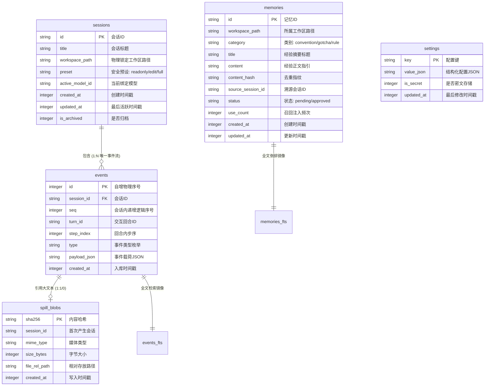

# 数据库设计说明书

> 文档标识：`docs/阶段-2-设计/03-数据库设计说明书.md`  
> 归属阶段：生命周期阶段-2-设计  
> 前置依赖：`01-概要设计说明书.md`、`02-详细设计说明书.md`、`CONTEXT.md` (D5, D9, D10, D19, D39)  
> 目标读者：数据库管理员、核心后端开发人员

---

## 1. 存储架构原则与引擎选型

1. **绝对零 Native C++ 编译依赖**：
   严格采用 Node.js 22+ 原生内置的 `node:sqlite`（`DatabaseSync` 引擎），彻底杜绝 `better-sqlite3`、`node-gyp`、Visual Studio MSVC 等外部编译环境的依赖。
2. **高并发读写性能保障 (WAL 模式)**：
   数据库实例启动时，强制执行：
   ```sql
   PRAGMA journal_mode = WAL;
   PRAGMA synchronous = NORMAL;
   PRAGMA foreign_keys = ON;
   ```
   实现读写操作完全互不阻塞，读请求零锁等待。
3. **分层物理存储策略**：
   - **系统级主库**：存放于 `~/.harness/harness.db`（可通过 `--data-dir` 覆盖），管理会话总览、事件日志真相、全局配置与全局资产；
   - **工作区级专属存储**：根据工作区选择的存储策略，独立落盘在项目根目录（如 `<workspace>/.harness/memory.sqlite` 或 `<workspace>/.harness/memory.md`），随项目代码库隔离或版本化协同；
   - **大文本寻址落盘 (Spill Blobs)**：超长工具执行输出与抓取网页正文（> 50KB）作为纯文本落盘于 `~/.harness/blobs/<sha256>.txt`，主库仅存指针与摘要。

---

## 2. 核心实体关系模型 (E-R Model)



---

## 3. 详细数据表结构定义 (DDL)

### 3.1 会话元数据表 (`sessions`)
记录会话基本状态，维系工作区路径不可变绑定。

| 字段名 | 类型 | 约束 | 业务说明 |
| :--- | :--- | :--- | :--- |
| `id` | TEXT | PRIMARY KEY | 会话唯一标识符（如 `sess_89f2a4`） |
| `title` | TEXT | NOT NULL DEFAULT '新对话' | 会话标题（由模型自动总结或用户重命名） |
| `workspace_path` | TEXT | NOT NULL | **绑定的绝对物理工作区路径（创建后只读锁定不可变）** |
| `preset` | TEXT | NOT NULL DEFAULT 'edit' | 权限安全预设：`readonly`（只读）/ `edit`（标准）/ `full`（全权） |
| `active_model_id` | TEXT | NOT NULL | 当前会话选用的模型 ID（如 `deepseek-chat`） |
| `created_at` | INTEGER | NOT NULL | 创建时间戳（毫秒） |
| `updated_at` | INTEGER | NOT NULL | 最后活跃时间戳（毫秒） |
| `is_archived` | INTEGER | NOT NULL DEFAULT 0 | 是否已归档（0: 正常，1: 已归档） |

```sql
CREATE TABLE IF NOT EXISTS sessions (
    id TEXT PRIMARY KEY,
    title TEXT NOT NULL DEFAULT '新对话',
    workspace_path TEXT NOT NULL,
    preset TEXT NOT NULL DEFAULT 'edit',
    active_model_id TEXT NOT NULL,
    created_at INTEGER NOT NULL,
    updated_at INTEGER NOT NULL,
    is_archived INTEGER NOT NULL DEFAULT 0
);

CREATE INDEX IF NOT EXISTS idx_sessions_updated ON sessions(updated_at DESC);
CREATE INDEX IF NOT EXISTS idx_sessions_workspace ON sessions(workspace_path);
```

---

### 3.2 追加式事件日志表 (`events` · 唯一真相)
会话内所有思考、消息、工具交互的不可变事实日志。

| 字段名 | 类型 | 约束 | 业务说明 |
| :--- | :--- | :--- | :--- |
| `id` | INTEGER | PRIMARY KEY AUTOINCREMENT | 物理单调自增序号 |
| `session_id` | TEXT | NOT NULL, FK &rarr; sessions(id) | 所属会话标识 |
| `seq` | INTEGER | NOT NULL | **会话内局部单调递增逻辑序号 (1, 2, 3...)** |
| `turn_id` | TEXT | NOT NULL | 交互回合标识（如 `turn_01`） |
| `step_index` | INTEGER | NOT NULL DEFAULT 0 | 回合内迭代步序（0: 首轮分析，1: 工具返回后第二步...） |
| `type` | TEXT | NOT NULL | 事件类型枚举（见下表） |
| `payload_json` | TEXT | NOT NULL | 结构化事件数据 JSON 文本 |
| `created_at` | INTEGER | NOT NULL | 事件入库时间戳（毫秒） |

```sql
CREATE TABLE IF NOT EXISTS events (
    id INTEGER PRIMARY KEY AUTOINCREMENT,
    session_id TEXT NOT NULL,
    seq INTEGER NOT NULL,
    turn_id TEXT NOT NULL,
    step_index INTEGER NOT NULL DEFAULT 0,
    type TEXT NOT NULL,
    payload_json TEXT NOT NULL,
    created_at INTEGER NOT NULL,
    FOREIGN KEY(session_id) REFERENCES sessions(id) ON DELETE CASCADE,
    UNIQUE(session_id, seq)
);

CREATE INDEX IF NOT EXISTS idx_events_lookup ON events(session_id, seq);
CREATE INDEX IF NOT EXISTS idx_events_turn ON events(session_id, turn_id);
```

#### 事件类型 (`type`) 业务枚举表
- `session/created`: 会话初建事件（记录工作区初始规范与配置）
- `message/user`: 工程师提交的用户需求或追问文本
- `request/context`: **至关重要**。发给模型前锁定的完整输入快照（包含 System Prompt、裁剪的历史消息、注入的 Skills 与记忆条目）
- `stream/chunk`: 模型流式生成的文本或思考（Reasoning）分片
- `message/assistant`: 模型回合内输出的完整应答文本（若中途网络中断，payload 标记 `incomplete: true` 供断点续接）
- `tool/call`: 模型决策发起的结构化工具调用（toolName, callId, args）
- `tool/approval_requested`: 命中安全拦截规则，挂起等待审批
- `tool/approval_resolved`: 人工审批通过或拒绝操作记录
- `tool/result`: 工具执行结果回灌（stdout, stderr, exitCode，敏感内容已由正则替换为 `[REDACTED]` 兜底）
- `compaction/triggered`: 触发滑动窗口压缩与提取生成的摘要事件
- `session/aborted`: 工程师显式打断终止

---

### 3.3 大输出溢出落盘表 (`spill_blobs` · D68 私有子目录隔离模式)
管理超长执行日志的元数据，避免数据库膨胀。

| 字段名 | 类型 | 约束 | 业务说明 |
| :--- | :--- | :--- | :--- |
| `sha256` | TEXT | PRIMARY KEY | 内容 SHA-256 唯一指纹哈希 |
| `session_id` | TEXT | NOT NULL | 所属会话 ID（生命周期强绑定） |
| `mime_type` | TEXT | NOT NULL DEFAULT 'text/plain' | 内容媒体类型 |
| `size_bytes` | INTEGER | NOT NULL | 实际内容字节总数 |
| `file_rel_path` | TEXT | NOT NULL | 相对私有目录 `sessions/<session_id>/blobs/` 的文件存放路径 |
| `created_at` | INTEGER | NOT NULL | 写入时间戳 |

```sql
CREATE TABLE IF NOT EXISTS spill_blobs (
    sha256 TEXT PRIMARY KEY,
    session_id TEXT NOT NULL,
    mime_type TEXT NOT NULL DEFAULT 'text/plain',
    size_bytes INTEGER NOT NULL,
    file_rel_path TEXT NOT NULL,
    created_at INTEGER NOT NULL
);

CREATE INDEX IF NOT EXISTS idx_spill_session ON spill_blobs(session_id);
```

---

### 3.4 会话历史 FTS5 全文倒排虚拟表 (`events_fts`)
基于 SQLite 原生 FTS5 引擎提供对历史提问、模型解答与命令的毫秒级全文检索。

```sql
CREATE VIRTUAL TABLE IF NOT EXISTS events_fts USING fts5(
    session_id UNINDEXED,
    event_type UNINDEXED,
    content,
    tokenize = 'unicode61 remove_diacritics 2'
);
```

---

### 3.5 记忆规约与经验资产表 (`memories`)
用于存储从完成的任务中提炼沉淀的工程规约与踩坑记录。

| 字段名 | 类型 | 约束 | 业务说明 |
| :--- | :--- | :--- | :--- |
| `id` | TEXT | PRIMARY KEY | 记忆唯一标识符（如 `mem_01`） |
| `workspace_path` | TEXT | NOT NULL | 所属工作区绝对路径（或 `global` 全局共享） |
| `category` | TEXT | NOT NULL | 类别：`convention` (开发规范) / `gotcha` (排错踩坑) / `architecture` (架构) / `rule` (铁律) |
| `title` | TEXT | NOT NULL | 记忆简明摘要标题 |
| `content` | TEXT | NOT NULL | 注入模型的约束正文指引 |
| `content_hash` | TEXT | NOT NULL | 正文 SHA-256 指纹（**用于存储迁移时自动去重**） |
| `source_session_id`| TEXT | NULL | 溯源：沉淀出该经验的初始会话 ID |
| `status` | TEXT | NOT NULL DEFAULT 'approved' | 状态：`pending_review` (半自动待审核) / `approved` (已生效) / `rejected` (已废弃) |
| `use_count` | INTEGER | NOT NULL DEFAULT 0 | 该经验在后续会话中被命中召回注入的累计频次 |
| `created_at` | INTEGER | NOT NULL | 记录创建时间戳 |
| `updated_at` | INTEGER | NOT NULL | 最后更新时间戳 |

```sql
CREATE TABLE IF NOT EXISTS memories (
    id TEXT PRIMARY KEY,
    workspace_path TEXT NOT NULL,
    category TEXT NOT NULL,
    title TEXT NOT NULL,
    content TEXT NOT NULL,
    content_hash TEXT NOT NULL,
    source_session_id TEXT,
    status TEXT NOT NULL DEFAULT 'approved',
    use_count INTEGER NOT NULL DEFAULT 0,
    created_at INTEGER NOT NULL,
    updated_at INTEGER NOT NULL,
    UNIQUE(workspace_path, content_hash)
);

CREATE INDEX IF NOT EXISTS idx_memories_ws_status ON memories(workspace_path, status);
```

---

### 3.6 记忆 FTS5 倒排索引表与自动触发器 (`memories_fts`)
为记忆库提供关键词高频召回，配置自动化数据同步触发器。

```sql
CREATE VIRTUAL TABLE IF NOT EXISTS memories_fts USING fts5(
    memory_id UNINDEXED,
    title,
    content,
    category,
    tokenize = 'unicode61'
);

-- 自动触发器：新增记忆自动同步进倒排索引
CREATE TRIGGER IF NOT EXISTS trg_memories_ai AFTER INSERT ON memories BEGIN
    INSERT INTO memories_fts(memory_id, title, content, category)
    VALUES (new.id, new.title, new.content, new.category);
END;

-- 自动触发器：删除记忆自动剔除倒排索引
CREATE TRIGGER IF NOT EXISTS trg_memories_ad AFTER DELETE ON memories BEGIN
    DELETE FROM memories_fts WHERE memory_id = old.id;
END;
```

---

### 3.7 系统全局设置表 (`settings`)
以 Key-Value 模式统一存储系统基础设置（服务端口、Token 口令、主题配色、Provider 凭据等）。

| 字段名 | 类型 | 约束 | 业务说明 |
| :--- | :--- | :--- | :--- |
| `key` | TEXT | PRIMARY KEY | 配置键（如 `server.port`、`server.token`、`ui.theme`） |
| `value_json` | TEXT | NOT NULL | 结构化 JSON 配置值 |
| `is_secret` | INTEGER | NOT NULL DEFAULT 0 | 是否为加密敏感字段（1: 走 AES-256-GCM 密文存储，0: 明文） |
| `updated_at` | INTEGER | NOT NULL | 最后修改时间戳 |

```sql
CREATE TABLE IF NOT EXISTS settings (
    key TEXT PRIMARY KEY,
    value_json TEXT NOT NULL,
    is_secret INTEGER NOT NULL DEFAULT 0,
    updated_at INTEGER NOT NULL
);
```
