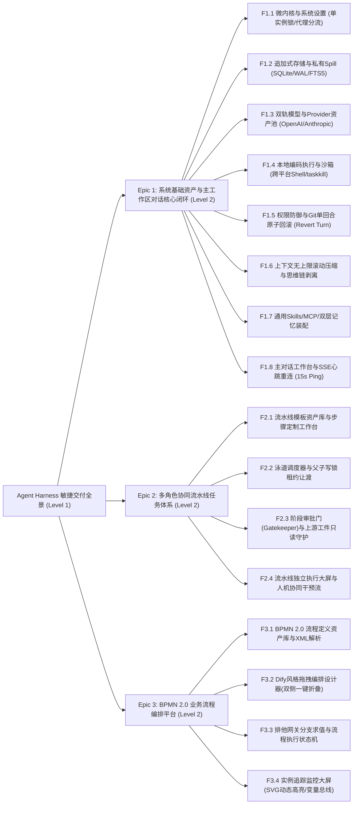
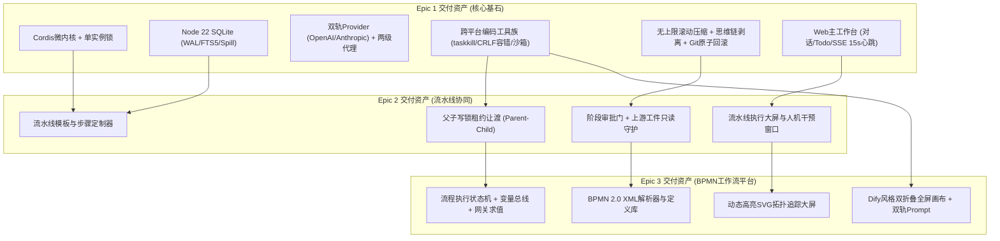

# Agent Harness WBS 任务工作分解结构说明书 (敏捷深化版)

> 文档标识：`docs/阶段-3-实现/01-WBS工作分解结构说明书.md`  
> 归属阶段：生命周期阶段-3-实现  
> 前置依赖：`docs/阶段-1-需求/功能模块需求规格说明书.md`、`docs/阶段-2-设计/`（01/02/03/04）、`CONTEXT.md` (D1–D69)、`docs/第一轮评审问题.md` (Q1–Q12)  
> 目标读者：项目经理、技术主管、敏捷架构师、核心开发工程师、测试工程师  
> 核心原则：**以敏捷端到端可交付价值为导向**，彻底废除机械的横向技术拼装，将全系统划分为三大业务史诗（Epics），全量吸纳首轮架构盘问定案（Q1–Q12），定义粒度清晰、输入输出严密、验收门禁可执行的原子工作包（Work Packages）。

---

## 1. 敏捷 WBS 分级原则与编码规范

本工作分解结构结合 Agile 软件工程体系与 Monorepo 工程物理分层，采用 4 级分解树：
- **Level 1（系统级）**：Agent Harness 整体产品交付
- **Level 2（敏捷史诗 Epic）**：三大业务交付阶段
  - **Epic 1：系统基础资产与主工作区对话核心闭环 (Core MVP & Single-Agent)**
  - **Epic 2：多角色协同流水线任务交付体系 (Multi-Role Pipeline)**
  - **Epic 3：BPMN 2.0 业务流程定义与编排平台 (BPMN Workflow Engine)**
- **Level 3（功能特性 Feature）**：支撑史诗落地的业务子系统
- **Level 4（工作包 WP）**：原子交付单元（包含明确的代码落位、依赖前提、交付物与验收验证准则）

### WBS 编码规则
`WBS-[Epic序号]-[Feature编号]-[子项序号]`  
例如：`WBS-01-02-01` 代表 Epic 1 下第 2 个 Feature 的第 1 个原子工作包。

---

## 2. 敏捷 WBS 全景分解树

---

## 3. 详细 WBS 工作包字典

---

### 史诗一：系统基础资产与主工作区对话核心闭环 (Epic 1: Core MVP)

> **业务交付目标**：实现一个高度可用、跨平台韧性、具备自愈与后悔药机制的独立编码 Agent 工作台。开发者能配置模型、设置工作区、享受双轨代理穿透、与 Agent 展开深度编码对话（支持精密原子改写、单回合原子撤销、超长会话滚动压缩与离线断点恢复）。

#### F1.1：微内核底座、系统设置与网络安全 (Kernel & System Foundation)
| WBS 编码 | 工作包名称 | 工作内容、功能边界与架构决策 | 代码落位 | 验收与验证准则 |
| :--- | :--- | :--- | :--- | :--- |
| **WBS-01-01-01** | Cordis-like 插件微内核核心实现 | 实现 `Context`、`Service` 依赖注入、生命周期钩子（`init`, `start`, `stop`）与 Fail-Fast 启动回滚机制（D6, D23） | `packages/kernel/` | 单元测试覆盖服务注册、依赖按序拓扑启动；缺少依赖立即抛错并优雅回滚 |
| **WBS-01-01-02** | 全局单实例文件锁防线 | 启动时检查并写入 `~/.harness/.lock`（含 PID、端口与时间戳）；退出时自动释放（D65, Q6） | `apps/server/src/instance-lock.ts` | 启动第二进程时立即被拦截阻断，输出友好提示与既有端口，杜绝 `SQLITE_BUSY` |
| **WBS-01-01-03** | 系统配置中心与敏感凭据加密 | 提供端口、Token、主题、字体持久化存储；实现 AES-256-GCM 凭据加解密器（D10, D32） | `packages/plugins/storage-sqlite/` | 敏感密钥落盘 100% 密文存储，日志脱敏，内存按需解密，篡改密文抛出异常 |
| **WBS-01-01-04** | 两级网络代理调度引擎 | 基于 Node 22 `undici.EnvHttpProxyAgent`，实现全局代理配置与 `NO_PROXY` 白名单直连分流（D60, D63, Q3） | `apps/server/src/network/proxy-dispatcher.ts` | 配置 HTTP/SOCKS5 代理后外网请求正常穿透；`localhost` 强制直连；静默 45s 硬超时熔断挂起 |

#### F1.2：追加式事件真相存储与大文本 Spill (Persistence & Spill)
| WBS 编码 | 工作包名称 | 工作内容、功能边界与架构决策 | 代码落位 | 验收与验证准则 |
| :--- | :--- | :--- | :--- | :--- |
| **WBS-01-02-01** | Node 22 原生 SQLite 引擎初始化 | 封装 `node:sqlite`（`DatabaseSync`），配置 WAL 模式、NORMAL 同步与跨线程读写排队（D9） | `packages/plugins/storage-sqlite/src/database.ts` | 启动时自动建立数据库，无 native 依赖；高频写入无锁库报错 |
| **WBS-01-02-02** | 追加式事件日志引擎 (Event Store) | 实现 `events` 表只增不改，维护会话局部连续 `seq`；提供按 `seq` 区间精确重放消息树（D5, D20） | `packages/plugins/storage-sqlite/src/event-store.ts` | 模拟 1000 次高频事件写入，`seq` 严格连续单调自增，违反唯一约束自动事务回滚 |
| **WBS-01-02-03** | 会话私有 Spill Blobs 隔离服务 | 超 50KB 输出自动计算 SHA-256 存入 `~/.harness/sessions/<id>/blobs/`；删除会话原子清空目录（D68, Q11） | `packages/plugins/storage-sqlite/src/spill-service.ts` | 超长文本自动转为外部文件寻址，事件库仅存指针；删除会话时物理文件彻底清空 |
| **WBS-01-02-04** | FTS5 全文倒排检索虚拟表 | 创建 `events_fts` 倒排表，挂载 unicode61 分词器与同步触发器，提供毫秒级搜索 | `packages/plugins/storage-sqlite/src/fts.ts` | 在 10,000 条历史日志中关键词检索耗时 < 5ms，中英混排检索精准 |

#### F1.3：双轨模型接入与 Provider 资产池 (Models & Providers)
| WBS 编码 | 工作包名称 | 工作内容、功能边界与架构决策 | 代码落位 | 验收与验证准则 |
| :--- | :--- | :--- | :--- | :--- |
| **WBS-01-03-01** | 统一 ModelProvider 协议 Seam | 定义统一的模型调用接口，封装入参归一化、流式 Chunk 管道与 Token 消耗回调 | `packages/core/src/provider/provider-interface.ts` | 规范化上层调用契约，Provider 与调度器完全解耦 |
| **WBS-01-03-02** | OpenAI 兼容适配器与自动探测 | 适配 DeepSeek、Ollama 等；实现 `POST /api/providers/models` 连通握手探测与列表拉取（D3, D38） | `packages/plugins/provider-openai/` | 填入 Key 和 BaseURL 后一键拉取模型成功；支持 DeepSeek 特有 `reasoning_content` 提取 |
| **WBS-01-03-03** | Anthropic 原生协议适配器 | 原生接入 `/v1/messages`，深度适配 Prompt Caching（4个断点）与原生 Thinking 块（D61, Q3） | `packages/plugins/provider-anthropic/` | 原生流式接收正常；测试验证 Prompt Caching 命中时输入 Token 节省 90% |
| **WBS-01-03-04** | Provider 专项代理与卡片秒切 | 支持 Provider 独立配置直连/继承/独立代理；卡片提供独立 Toggle 开关秒级控制（D60） | `apps/web/src/features/config/providers/` | 卡片与弹窗代理开关状态双向同步；关闭代理时强制直连，开启时经由指定端口转发 |

#### F1.4：本地编码执行与跨平台沙箱 (Tools & Execution)
| WBS 编码 | 工作包名称 | 工作内容、功能边界与架构决策 | 代码落位 | 验收与验证准则 |
| :--- | :--- | :--- | :--- | :--- |
| **WBS-01-04-01** | 原子读写与换行符容错 Edit 工具 | 实现 `read_file`, `write_file`, `edit_file`；吸收 OpenCode 经验统一 CRLF/LF 换行符容错（D16, D62） | `packages/plugins/tools-coding/src/file-tools.ts` | 先读后写强校验；Windows 与 Linux 换行符差异不报错；连续 3 次失败自动熔断（D46） |
| **WBS-01-04-02** | 沙箱绝对路径防逃逸守卫 | 基于 `fs.realpathSync` 物理反解，校验文件是否位于绑定的工作区根目录之内（D19, D52） | `packages/plugins/tools-coding/src/sandbox-guard.ts` | 尝试访问 `../../` 或通过符号链接 (Symlink) 穿透越界时立即拦截并抛错拒绝 |
| **WBS-01-04-03** | 工程级文件查找与防黑洞过滤 | 实现 `glob` 与 `grep`；强制跳过 `node_modules`、`.git` 等目录；单次输出硬卡 200 条防 OOM | `packages/plugins/tools-coding/src/search-tools.ts` | 在巨型项目中搜索秒级返回，大文件与巨型依赖目录被严格忽略过滤 |
| **WBS-01-04-04** | 持久 Shell 与 Windows 探测硬杀 | 实现持久终端；Windows 探测 `pwsh`&rarr;`powershell`&rarr;`cmd` 并注入 ExecutionPolicy Bypass；打断使用 `taskkill /T /F`（D18, D62, Q2） | `packages/plugins/tools-coding/src/shell-executor.ts` | 命令单次 120s 超时掐断；点击 Abort 后整个子孙进程树被干净终结，零端口残留 |
| **WBS-01-04-05** | 结构化人机澄清提问 (QuestionV2) | 参考 OpenCode `QuestionV2`，生成 `que_<uuid>`，暴露 reply/reject 端点，支持断线重连（D53, Q8） | `packages/core/src/question-service.ts` | Agent 提问后挂起；用户提交选项后唤醒继续；用户关闭弹窗抛出 Rejected 提示模型跳过 |

#### F1.5：权限决策流水线与单回合 Git 原子回滚 (Permissions & Git Rollback)
| WBS 编码 | 工作包名称 | 工作内容、功能边界与架构决策 | 代码落位 | 验收与验证准则 |
| :--- | :--- | :--- | :--- | :--- |
| **WBS-01-05-01** | Deny > Ask > Allow 权限流水线 | 工具调用前求值：黑名单硬拦截，高危动作进入审批挂起，白名单或全权模式放行（D7, D28） | `packages/core/src/permission-pipeline.ts` | 尝试修改 `.git` 物理文件直接 Deny；高危 Shell 脚本准确进入 `waiting_approval` 状态 |
| **WBS-01-05-02** | 单回合 Git Checkpoint 隔离保护 | 回合开始前自动快照隔离用户未提交手写修改；记录本回合修改文件清单（D59, Q1） | `packages/core/src/git-checkpoint.ts` | 用户原有的未提交手写代码被安全隔离，不被后续回滚误杀 |
| **WBS-01-05-03** | 单回合原子回滚 (Revert Turn) | 提供 `POST /api/sessions/:id/revert-turn`；针对已跟踪文件执行 checkout，新文件 clean（D59, Q4） | `packages/core/src/git-rollback.ts` | 点击【撤销本回合修改】一秒还原干净基线；新回合开启自动静默销毁前一回合快照 |

#### F1.6：上下文治理、滚动压缩与思维链剥离 (Governor & Token)
| WBS 编码 | 工作包名称 | 工作内容、功能边界与架构决策 | 代码落位 | 验收与验证准则 |
| :--- | :--- | :--- | :--- | :--- |
| **WBS-01-06-01** | Token 分层计量与动态预警线 | 字符估算预判 + Provider usage 精确校正；绑定生效物理窗口 80% 动态设置压缩线（D24, D51） | `packages/core/src/governor/token-tracker.ts` | 顶栏实时跳动显示当前 Token 与美元费用；窗口超限提前阻止 |
| **WBS-01-06-02** | 思考模型思维链协议折叠剥离 | 独立提取 `reasoning` 事件入库；历史消息回传（`deriveMessages`）自动剥离思考块（D58） | `packages/core/src/governor/reasoning-pruner.ts` | 前端支持展开查看思维链；后续多轮请求上下文不包含旧思维链，资费节省显著 |
| **WBS-01-06-03** | 无上限滚动压缩与溢出自动恢复 | 参考 OpenCode `SessionCompaction`，以最新 `compaction.seq` 为历史基线；实现 `compactAfterOverflow`（D50, Q7） | `packages/core/src/governor/compaction.ts` | 50 轮超长对话平滑滚动压缩；遭遇 Provider 溢出报错时自动就地压缩重试不中断 |

#### F1.7：扩展能力、MCP 隔离与双层记忆装配 (Ecosystem & Memory)
| WBS 编码 | 工作包名称 | 工作内容、功能边界与架构决策 | 代码落位 | 验收与验证准则 |
| :--- | :--- | :--- | :--- | :--- |
| **WBS-01-07-01** | 通用 Agent Skills 渐进披露加载 | 解析 YAML Front-matter；冷态仅向 System Prompt 注入元数据，热态通过 `skill(name)` 加载正文（D40） | `packages/plugins/skills/` | 冷态零上下文负担；触发关键词后模型主动调用工具，成功加载完整规约正文 |
| **WBS-01-07-02** | MCP 客户端连接池与命名空间隔离 | 支持 Stdio/SSE 模式；外部工具强制加 `mcp__<server>__<tool>` 前缀，保留字绝对保护（D14, D66, Q9） | `packages/plugins/tools-mcp/` | 外部 MCP 工具前缀隔离正常，无法注册同名 `edit_file`；单个 MCP 超时自动局部隔离 |
| **WBS-01-07-03** | 全局与项目双层记忆级联装配 | 对齐 OpenCode `instruction-context.ts`：合并 `~/.harness/` 与 `<workspace>/` 规约去重注入（D67, Q10） | `packages/plugins/memory/src/memory-loader.ts` | 请求前按来源路径标注并去重合并；跨项目规约互不干扰，通用习惯免重复调教 |
| **WBS-01-07-04** | 记忆受控迁移向导与分流 | 支持 Markdown/SQLite/Hybrid 模式；向导提供“丢弃全新起步”与“无损平滑迁移”（D39） | `packages/plugins/memory/src/migration-wizard.ts` | 切换模式时自动 `.bak` 备份；无损迁移按 SHA-256 原子去重写入 |

#### F1.8：服务端网关、主工作台与心跳重连 (Server Gateway & Web Chat)
| WBS 编码 | 工作包名称 | 工作内容、功能边界与架构决策 | 代码落位 | 验收与验证准则 |
| :--- | :--- | :--- | :--- | :--- |
| **WBS-01-08-01** | Fastify 网关与工作区独占写锁 | 绑定会话与绝对工作区；实现同一工作区写互斥、读共享排队调度（D19, D42, D43） | `apps/server/src/workspace-lock.ts` | 多个会话访问同一工作区时，写操作互斥排队，前端提示倒计时与抢占接管 |
| **WBS-01-08-02** | SSE 流式推送与 15s 心跳重连 | 每一帧带 `seq`；服务端每 15s 推送 `: ping`；前端 `visibilitychange` 感知重连补齐（D11, D69, Q12） | `apps/server/src/sse-gateway.ts` | 笔记本息屏合盖 20 分钟后唤醒，前端自动触发重连并在 1 秒内拉齐最新事件 |
| **WBS-01-08-03** | 现代暗色工程师 Web 界面工作台 | React 18 + Tailwind；交付主对话流、Todo 任务卡片、Diff 审阅弹窗与系统设置（D12, D31） | `apps/web/src/features/chat/` | 完整还原高保真原型；顶栏即时秒切模型；包含 Revert Turn 与流式断点恢复卡片 |
| **WBS-01-08-04** | 首次运行两步破冰就绪向导 | 零配置初次启动自动弹出轻量弹窗，配 Key + 选目录，1分钟内打通端到端首个会话（D57） | `apps/web/src/features/chat/first-run-wizard.tsx` | 空库状态下流畅引导破冰，填写后秒级开启首轮会话并自动锁定工作区 |

---

### 史诗二：多角色协同流水线任务交付体系 (Epic 2: Multi-Role Pipeline)

> **业务交付目标**：在具备成熟单 Agent 能力的基础上，支持固化软件研发的标准阶段泳道（PRD &rarr; 架构设计 &rarr; TDD 编码 &rarr; QA 验收），具备阶段工件契约传递、审批卡点与父子写锁租约让渡机制。

#### F2.1：流水线模板资产与定制工作台 (Templates & Configuration)
| WBS 编码 | 工作包名称 | 工作内容、功能边界与架构决策 | 代码落位 | 验收与验证准则 |
| :--- | :--- | :--- | :--- | :--- |
| **WBS-02-01-01** | 流水线模板数据模型与 DDL | 定义 `pipelines` 与 `pipeline_stages` 表；管理阶段顺序、角色人设、推荐模型与工件路径（D36, D38） | `packages/plugins/storage-sqlite/src/pipeline-schema.ts` | 支持标准 CRUD；工件输出目录支持选填，留空自动按 Git 增量追踪 |
| **WBS-02-01-02** | 模板列表大屏与管理界面 | 交付 `config-pipelines.html` 对应的前端组件，展示模板卡片、阶段概览与操作按钮 | `apps/web/src/features/pipeline/template-list.tsx` | 列表清晰展现各阶段角色；支持一键复制模板与进入定制工作台 |
| **WBS-02-01-03** | 步骤双向插入定制工作台 | 交付 `run-pipeline-create.html` 对应的前端组件，支持末尾追加与卡片间插入步骤（D36） | `apps/web/src/features/pipeline/step-editor.tsx` | 插入步骤元素与已有步骤 100% 格式对齐，配置字段保存自洽 |

#### F2.2：泳道调度引擎与父子写锁租约让渡 (Pipeline Runner & Lock Delegation)
| WBS 编码 | 工作包名称 | 工作内容、功能边界与架构决策 | 代码落位 | 验收与验证准则 |
| :--- | :--- | :--- | :--- | :--- |
| **WBS-02-02-01** | 多阶段顺序执行泳道状态机 | 管理流水线实例状态（`idle`, `running`, `waiting_gate`, `completed`），驱动各阶段 Agent 依次唤醒 | `packages/core/src/pipeline/pipeline-runner.ts` | 上一阶段成功后自动触发下一阶段；阶段失败或异常中断时安全保全上下文 |
| **WBS-02-02-02** | 父子工作区写锁租约让渡 | 实施 Parent-Child Lock Delegation：下游阶段/子 Agent 继承写锁租约，上游挂起，完毕返还（D64, Q5） | `packages/core/src/pipeline/lock-delegator.ts` | 阶段流转时写锁无缝转移，彻底杜绝父子死锁，全程守住工作区唯一写操作红线 |

#### F2.3：阶段审批门与上游工件基线保护 (Gatekeeper & Artifacts)
| WBS 编码 | 工作包名称 | 工作内容、功能边界与架构决策 | 代码落位 | 验收与验证准则 |
| :--- | :--- | :--- | :--- | :--- |
| **WBS-02-03-01** | 阶段交付工件捕获与契约注入 | 提取阶段产出的物理文件或 Git Diff，结构化注入下一阶段的输入上下文提示词 | `packages/core/src/pipeline/artifact-manager.ts` | 下游 Agent 准确识别上游阶段提交的架构设计文档或接口契约代码 |
| **WBS-02-03-02** | 上游审定工件只读守护机制 | 上游通过审批门放行的交付工件，在后续所有下游阶段中强制设为文件沙箱只读（D54） | `packages/core/src/pipeline/artifact-guard.ts` | 下游 Agent 尝试用 `edit_file` 修改上游审定 PRD 或架构图时立即被沙箱拦截 |
| **WBS-02-03-03** | 阶段人工审批门卡点 (Gatekeeper) | 阶段结束前强制挂起，前端展示工件清单与审批卡点，支持单次放行或打回修改（D36） | `apps/web/src/features/pipeline/gatekeeper-modal.tsx` | 未经人类明确点击放行，后续阶段绝对不启动，审批记录不可变落盘 |

#### F2.4：独立任务执行工作台与人机干预流 (Execution Workspace)
| WBS 编码 | 工作包名称 | 工作内容、功能边界与架构决策 | 代码落位 | 验收与验证准则 |
| :--- | :--- | :--- | :--- | :--- |
| **WBS-02-04-01** | 任务列表大屏与实例监控 | 交付 `run-pipeline.html` 组件，全局监控所有并发运行的流水线任务状态与工作区路径 | `apps/web/src/features/pipeline/instance-list.tsx` | 实时呈现泳道进度条、当前负责角色、耗时与错误告警 |
| **WBS-02-04-02** | 独立任务执行工作台 | 交付 `run-pipeline-detail.html` 组件：工作区锁定、四阶段泳道大图、人机干预对话流（D36） | `apps/web/src/features/pipeline/pipeline-workspace.tsx` | 人类可随时在当前活动步骤下发补充要求，Agent 现场调整并反馈 |

---

### 史诗三：BPMN 2.0 业务工作流编排平台 (Epic 3: BPMN Workflow Platform)

> **业务交付目标**：面向高级复杂的业务流研发场景，原生支持 BPMN 2.0 XML 规范，提供 Dify 风格的高保真可视化拖拽编排画板、双轨 Prompt、排他网关分支求值沙盒与动态 SVG 实例流转审计。

#### F3.1：BPMN 2.0 模型资产库与标准解析 (Definition & Assets)
| WBS 编码 | 工作包名称 | 工作内容、功能边界与架构决策 | 代码落位 | 验收与验证准则 |
| :--- | :--- | :--- | :--- | :--- |
| **WBS-03-01-01** | BPMN 2.0 XML 解析与流转模型 | 纯 TS 轻量解析 StartEvent、EndEvent、ServiceTask、UserTask、ExclusiveGateway、SequenceFlow | `packages/core/src/workflow/bpmn-parser.ts` | 标准 Camunda/bpmn.io XML 零报错解析为内部执行拓扑图，无 native 依赖 |
| **WBS-03-01-02** | 流程定义资产管理界面 | 交付 `config-workflows.html` 组件：展示流程名称、版本、节点统计、源码 XML 查看器 | `apps/web/src/features/workflow/definition-list.tsx` | 列表清晰展现节点与网关指标；支持导入本地 `.bpmn` 文件与在线查看 XML |

#### F3.2：Dify 风格可视化拖拽设计器 (Visual Canvas Designer)
| WBS 编码 | 工作包名称 | 工作内容、功能边界与架构决策 | 代码落位 | 验收与验证准则 |
| :--- | :--- | :--- | :--- | :--- |
| **WBS-03-02-01** | 双侧一键折叠 100% 满屏点阵画布 | 交付 `config-workflow-design.html` 画布核心：左物料栏与右抽屉可折叠，贝塞尔曲线连线（D37） | `apps/web/src/features/workflow/canvas/` | 折叠后释放 100% 满屏无遮挡视野；节点拖拽顺畅，曲线自动吸附锚点 |
| **WBS-03-02-02** | 深度节点参数检查器 (Node Inspector) | 右侧抽屉：输入变量消费 `${var}` 绑定、输出变量提取映射、双轨 Prompt 配置（D37） | `apps/web/src/features/workflow/inspector/` | 点击节点平滑滑出抽屉；System Prompt 与 User Prompt 双轨参数保存自洽 |
| **WBS-03-02-03** | 排他网关分支表达式在线沙盒 | 网关节点专用属性编辑器：配置 `${coverage >= 85}` 条件分支与 Default 流；在线求值预览（D37） | `apps/web/src/features/workflow/inspector/gateway-evaluator.tsx` | 输入测试变量可现场高亮计算出走的流向分支，配置错误实时红字预警 |

#### F3.3：工作流执行引擎与状态机流转 (Workflow Engine & State Machine)
| WBS 编码 | 工作包名称 | 工作内容、功能边界与架构决策 | 代码落位 | 验收与验证准则 |
| :--- | :--- | :--- | :--- | :--- |
| **WBS-03-03-01** | 全局上下文变量总线 (Variables Bus) | 实现工作流实例全局变量总线；上游输出写入，下游输入插值求值，具备脏写防御 | `packages/core/src/workflow/variables-bus.ts` | 变量跨节点流转准确，缺失必填变量自动中止并报告节点路径 |
| **WBS-03-03-02** | 流程执行状态机与分支路由 | 驱动 Token 在序列流上移动；ServiceTask 唤醒对应 Agent 执行；ExclusiveGateway 动态求值分支 | `packages/core/src/workflow/workflow-engine.ts` | 复杂分支判定流转精准无死锁；节点执行异常自动触发补偿或挂起 |

#### F3.4：实例追踪监控与动态拓扑高亮 (Instance Tracking & SVG Topology)
| WBS 编码 | 工作包名称 | 工作内容、功能边界与架构决策 | 代码落位 | 验收与验证准则 |
| :--- | :--- | :--- | :--- | :--- |
| **WBS-03-04-01** | 实例列表大屏与新建向导 | 交付 `run-workflow.html` 组件：全局工作流实例运行状态过滤、消耗指标、启动新实例向导 | `apps/web/src/features/workflow/instance-list.tsx` | 支持按状态（进行中、挂起、完成）过滤；弹窗启动实例自动校验工作区 |
| **WBS-03-04-02** | 动态高亮 SVG 拓扑追踪工作台 | 交付 `run-workflow-detail.html` 组件：动态高亮已完成/执行中/失败节点、变量总线、干预流（D37） | `apps/web/src/features/workflow/instance-tracker.tsx` | SVG 拓扑节点状态实时呼吸灯高亮；支持在人工任务节点介入交互并恢复流转 |

---

## 4. 交付物汇总与跨史诗强依赖拓扑

---

## 5. RACI 责任分配矩阵

| 模块编码 | 业务模块简称 | 架构师 (A) | 开发负责人 (R) | 产品经理 (C) | 测试负责人 (I) |
| :--- | :--- | :---: | :---: | :---: | :---: |
| **Epic 1** | 微内核底座与系统设置 | **A** | **R** | C | I |
| **Epic 1** | 追加式存储与私有 Spill | **A** | **R** | C | I |
| **Epic 1** | 双轨模型与两级代理体系 | **A** | **R** | C | I |
| **Epic 1** | 本地执行与跨平台硬杀沙箱 | **A** | **R** | C | I |
| **Epic 1** | Git Checkpoint 与原子回滚 | **A** | **R** | C | I |
| **Epic 1** | 上下文滚动压缩与思维链剥离 | **A** | **R** | C | I |
| **Epic 1** | Web 主工作台与心跳重连 | C | **R** | **A** | I |
| **Epic 2** | 流水线模板与步骤定制 | C | **R** | **A** | I |
| **Epic 2** | 泳道调度与写锁租约让渡 | **A** | **R** | C | I |
| **Epic 2** | 上游工件只读保护与审批门 | **A** | **R** | C | I |
| **Epic 2** | 流水线执行工作台与干预流 | C | **R** | **A** | I |
| **Epic 3** | BPMN 2.0 标准解析与定义库 | **A** | **R** | C | I |
| **Epic 3** | Dify 风格双折叠画布设计器 | C | **R** | **A** | I |
| **Epic 3** | 网关表达式沙盒与变量总线 | **A** | **R** | C | I |
| **Epic 3** | 动态高亮 SVG 拓扑追踪工作台 | C | **R** | **A** | I |

---

## 6. WBS 验收与生命周期推进说明

本 WBS 说明书彻底理顺了系统从 **单智能体核心 MVP** 到 **流水线协同**，再到 **BPMN 业务工作流平台** 的三级跃迁路径，所有在第一轮架构评审（Q1–Q12）中敲定的技术决策均已在原子工作包中落实责任与验收准则。

本项目开发计划说明书（`02-项目开发计划说明书.md`）将以此 WBS 为基础，排布清晰的 Agile Sprint 敏捷迭代排期。

---

## 7. 实现偏差登记（2026-09-22 实测）

> 文档纪律：代码与文档不一致时，必须在文档登记实际状态，不得默认"文档即事实"。以下为逐条实测结论。

| WBS 编号 | 计划落点 | 实际落点 | 说明 |
| :--- | :--- | :--- | :--- |
| WBS-01-04-05 | `packages/core/src/question-service.ts` | `packages/core/src/question-broker.ts` | 功能与判据一致：`que_<uuid>` 标识、reply/reject 双轨、reject 交由模型兜底、断线可恢复 |
| WBS-01-05-01 | `packages/core/src/permission-pipeline.ts` | `packages/core/src/permission-gate.ts` | 判据一致：`deny > ask > allow`、危险命令进入 `waiting_approval`、拒绝 fail-closed |
| WBS-01-08-01 | `apps/server/src/workspace-lock.ts` | `packages/core/src/workspace-lock.ts` | 写锁落在 core，服务端引用；并发写返回 409 |
| WBS-01-08-02 | `apps/server/src/sse-gateway.ts` | `apps/server/src/index.ts`（内联） | 15s 心跳与 `?after=<seq>` 增量重放为内联实现，**尚无独立网关文件**；心跳间隔缺少可控时钟用例 |
| WBS-01-08-03 | `apps/web/src/features/chat/`（React 18 + Vite + Zustand，D12） | `apps/server/client/*.html`（零构建静态页） | **架构级偏差**：未引入 React/Vite 构建链，采用零构建静态页面；Todo 进度卡片与 Diff 审阅卡**尚未实现** |
| WBS-01-08-04 | `apps/web/src/features/chat/first-run-wizard.tsx` | `apps/server/client/run-chat.html` 内联向导 | 功能与判据一致（冷启动检测 + 两步引导 + 完成标记持久化）；未采用 React 组件形态 |
| 用例标签 | `TC-01-09-001`（AGENTS.md 模板生成器） | `apps/server/tests/agents-template.test.ts` | 文档 §3 未定义 `TC-01-09-*` 用例，该标签属**代码自拟**，需补入文档或改名 |
| 用例标签 | `TC-02-01` / `TC-02-02` | `packages/core/tests/turn-loop.test.ts`、`apps/server/tests/chat-loop.test.ts` | 编号与 Epic 2 流水线用例同形，但实际归属 **Epic 1 的 MOD-01/02（会话与调度）**，易误读，已在 RTM 中显式标注 |
| 用例扩展 | 文档原列 39 个用例 | 实为 44 个（新增 `TC-01-05-004` 审批、`TC-01-08-005` 破冰向导、`TC-01-08-006` 任务清单与 Diff 等） | RTM 已按实测校准为 44 个 |
| 版本控制 | AGENTS.md 要求 Conventional Commits / 分支保护 | **工作区无 `.git`，非 Git 仓库** | 无法执行提交与打标签；`v0.1.0` 标签需先初始化仓库（待用户确认） |

---

## 8. 待排期 Backlog（无任何 Sprint 承接项）

> 以下条目在**设计文档中有明确依据，但未被任何 WBS 工作包承接**。为避免"做了没人验收、没做没人记账"的漂移，此处显式立项，等待排期。

| 编号 | 名称 | 内容 | 设计依据 | 状态 |
| :--- | :--- | :--- | :--- | :---: |
| **BL-01** | 工具执行管线与内核 hook 扩展点 | `tools/pre-execute` waterfall、单调 guards、`tools/execute` around、`tools/post-execute` waterfall、`finalize`；内核暴露 hook 注册点 | 设计 §4.1 | 待排期 |
| **BL-02** | 插件内核配置化挂载 | `@harness/kernel` 真正接线到服务端、`harness.yml` 扁平列表按序挂载、缺依赖 Fail-Fast 回滚 | 设计 D6 / D30 | 待排期 |
| **BL-03** | `ctx.sandbox` seam | 可替换沙箱后端（本地 / Docker / 远端），本地后端含工作区根约束与网络出口策略 | 设计 §10.2 | 待排期 |
| **BL-04** | `fetch_url` 与 SSRF 防护 | 仅允许 http/https；拒绝解析到私有/回环/链路本地网段（含**重定向后的目标**）；响应体与超时上限 | 设计 §10.2 | 待排期 |
| **BL-05** | Anthropic 协议接入对话分流 | 按 Provider 协议选择适配器，启用 Prompt Caching 与原生思考块 | 设计 F7.1 / D61 | 待排期 |
| **BL-06** | Sprint 2 收尾项 | 破冰向导（WBS-01-08-04）、Todo 进度卡片与 Diff 审阅卡（WBS-01-08-03）、SSE 心跳间隔用例（WBS-01-08-02） | 本 WBS | **优先（Sprint 2 收尾）** |

**排期原则**：BL-06 属于已承诺的 Sprint 2 范围，优先闭合；BL-01～BL-05 属于架构收敛与能力补全，需先由产品/架构确认排入哪一个 Sprint，**不得以"顺手做了"的方式插队**。

