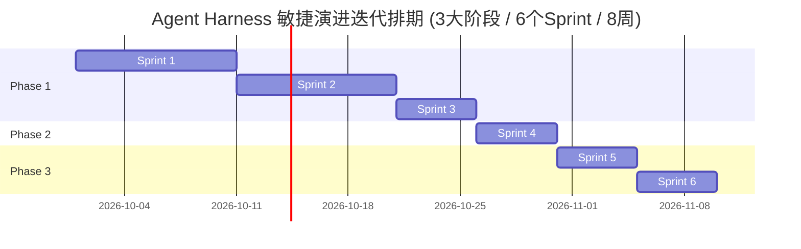

# Agent Harness 项目开发实现计划说明书 (敏捷迭代版)

> 文档标识：`docs/阶段-3-实现/02-项目开发计划说明书.md`  
> 归属阶段：生命周期阶段-3-实现  
> 前置依赖：`docs/阶段-3-实现/01-WBS工作分解结构说明书.md` (敏捷深化版)、`docs/阶段-2-设计/` (01/02/03/04)、`CONTEXT.md` (D1–D69)  
> 核心原则：**彻底摒弃传统的横向技术拼装，采用标准的 Scrum/Agile 敏捷迭代制**。以 2 周为一个 Sprint 交付周期，分为 **三大业务交付阶段 (Phase 1 至 Phase 3)**、共 **6 个敏捷 Sprint**。每个 Sprint 结束时必须产出**“垂直切片、端到端可运行、具备可演示前端 UI”**的可用软件增量。

---

## 1. 敏捷开发规划总览 (Agile Roadmap)

研发团队按照 **阶段一：核心对话与基础资产闭环 &rarr; 阶段二：多角色流水线任务交付 &rarr; 阶段三：BPMN 业务工作流编排平台** 的演进路线推进：

| 交付阶段 (Epic) | 敏捷 Sprint | 迭代周期 (按 2周/Sprint) | 目标交付版本 (Git Tag) | 核心业务交付增量 (Shippable Demo) | 重点贯通的前后端能力 |
| :--- | :--- | :--- | :---: | :--- | :--- |
| **Phase 1 核心对话与基础资产** | **Sprint 1** | Week 1–2 (10工作日) | **`v0.1.0-sprint.1`** | **系统配置中心、单实例锁与双轨 Provider 资产池可用版** | 插件微内核 + Node 22 SQLite WAL + 单实例锁 + 两级网络代理调度 (`undici`) + OpenAI/Anthropic 双轨协议与一键探测 + 设置中心 Web UI |
| **Phase 1 核心对话与基础资产** | **Sprint 2** | Week 3–4 (10工作日) | **`v0.1.0` (Core MVP)**| **主工作区对话核心闭环与单回合原子回滚正式版** | 跨平台文件精密编辑 (CRLF容错) + Windows `taskkill` 硬杀 + 单回合 Git Checkpoint 隔离与 Revert Turn + 无上限滚动压缩 + SSE 15s 心跳重连 + 主对话工作台 Web UI |
| **Phase 1 核心对话与基础资产** | **Sprint 3** | Week 5 (5工作日) | **`v0.1.1`** | **扩展生态、MCP 强隔离与全局/项目双层记忆版** | 通用 Skills 渐进披露 + MCP 客户端连接池 (`mcp__` 隔离) + 全局与项目双层记忆级联装配 (`instruction-context`) + 记忆受控迁移向导 UI |
| **Phase 2 多角色流水线任务** | **Sprint 4** | Week 6 (5工作日) | **`v0.2.0`** | **多角色流水线任务体系完整闭环正式版** | 流水线模板大屏 + 步骤双向插入定制器 + 泳道状态机 + 父子写锁租约让渡 (Parent-Child) + 上游工件只读守护 + 阶段审批门 (Gatekeeper) + 独立任务工作台 UI |
| **Phase 3 BPMN 业务流平台** | **Sprint 5** | Week 7 (5工作日) | **`v0.3.0-sprint.5`** | **BPMN 2.0 流程资产库与 Dify 风格双折叠设计器版** | BPMN 2.0 XML 纯 TS 轻量解析器 + 流程定义资产列表 + 双侧一键折叠 100% 满屏点阵画布 + 深度参数抽屉 (双轨Prompt) + 排他网关在线求值沙盒 |
| **Phase 3 BPMN 业务流平台** | **Sprint 6** | Week 8 (5工作日) | **`v0.3.0`** | **BPMN 业务工作流平台全链路闭环正式版** | 全局上下文变量总线 (Variables Bus) + 流程执行状态机 + 实例运行大屏 + 动态高亮 SVG 拓扑追踪工作台 + `scripts/self-check.ts` 离线秒级全量自检 |

---

## 2. 敏捷开发计划甘特图 (Agile Sprint Gantt)

---

## 3. 各 Sprint 详细交付契约与验收门禁

### Sprint 1：微内核、两级代理分流与双轨 Provider 资产池 (Week 1–2)
- **迭代目标**：构建跨平台的 Node 22 原生基础设施，打通网络代理穿透与双轨模型资产池，交付高可用的系统设置中心。
- **关联 WBS 工作包**：
  - `WBS-01-01-01` ~ `WBS-01-01-04` (微内核、单实例锁、系统配置、两级代理调度)
  - `WBS-01-02-01` ~ `WBS-01-02-04` (Node 22 SQLite WAL、追加式事件表、FTS5、Spill私有目录)
  - `WBS-01-03-01` ~ `WBS-01-03-04` (Provider Seam、OpenAI适配器、Anthropic适配器、卡片独立代理Toggle)
- **Sprint 结束可演示交付物 (Demo)**：
  1. 打开 Web 设置中心（`config-settings.html`）：可配置端口、0.0.0.0 Token、全局 HTTP/SOCKS5 代理，并支持 Bypass 绕过名单；
  2. 打开 Provider 管理中心（`config-providers.html`）：支持维护 OpenAI Compatible 与 Anthropic Native 双轨端点，输入 Key 后点击【获取模型列表】现场拉取模型填充下拉框；在卡片上一键切换【开启代理/强制直连】Toggle。
- **质量门禁**：
  - 尝试双击启动两次服务，第二进程立即安全阻断并提示已有 PID 与端口（单实例锁生效）；
  - 配置本地 SOCKS5 代理后，海外 API 测试连通成功；本地 `127.0.0.1` 请求强制直连不走代理；
  - 模拟 45 秒代理静默无 Chunk，系统触发硬超时熔断挂起，绝不静默降级直连。

---

### Sprint 2：主工作区对话核心闭环与单回合原子回滚 (Week 3–4 · Core MVP 交付)
- **迭代目标**：完成本地文件精密编辑、进程树硬杀、单回合 Git Checkpoint 隔离与 Revert Turn、无上限滚动压缩，交付完整的单智能体开发工作台。
- **关联 WBS 工作包**：
  - `WBS-01-04-01` ~ `WBS-01-04-05` (原子读写与换行符容错、沙箱防越界、grep/glob防黑洞、Windows Shell探测与 `taskkill` 硬杀、QuestionV2提问)
  - `WBS-01-05-01` ~ `WBS-01-05-03` (权限流水线、Git Checkpoint 隔离、Revert Turn 原子回滚)
  - `WBS-01-06-01` ~ `WBS-01-06-03` (Token计量、思维链剥离治理、无上限滚动压缩与溢出恢复)
  - `WBS-01-08-01` ~ `WBS-01-08-04` (工作区互斥写锁、SSE 15s 心跳、Web 主工作台、首次破冰向导)
- **Sprint 结束可演示交付物 (Demo)**：
  1. 首次打开弹出轻量两步破冰向导，1 分钟内绑定本地代码仓库；
  2. 真实对话跑通“读代码 &rarr; 编写测试 &rarr; 修改代码 &rarr; 运行测试”闭环，思维链默认折叠并可展开查阅；
  3. 演示【撤销本回合修改 (Revert Turn)】：一秒还原代码至回合开始前干净基线，用户原有的手写未提交修改完好无损；
  4. 演示打断：点击 Abort，Windows `taskkill` 干净掐断测试子进程树，零孤儿进程；
  5. 演示休眠：合上笔记本盖子 10 分钟后切回，前端自动利用 `visibilitychange` 秒级重连拉齐状态。
- **质量门禁**：
  - 针对 Windows CRLF 与 Linux LF 文件，`edit_file` 精确查找替换成功率 100%；
  - 50 轮长对话自动触发基于 Epoch/Seq 边界的滚动压缩，无报错中断；
  - 发生并发写冲突时，调度层原生挂起等待并呈现倒计时条。

---

### Sprint 3：扩展生态、MCP 强隔离与双层记忆装配 (Week 5)
- **迭代目标**：完善智能体的高级能力扩展，杜绝沙箱被外部生态劫持，确立全局与项目双层记忆体系。
- **关联 WBS 工作包**：
  - `WBS-01-07-01` ~ `WBS-01-07-04` (通用Skills、MCP连接池与 `mcp__` 隔离、全局/项目双层记忆、受控迁移向导)
- **Sprint 结束可演示交付物 (Demo)**：
  1. 挂载外部 MCP 服务：在 `config-mcp.html` 中查看暴露的工具，全部带有 `mcp__<server>__` 前缀，本地 `read_file` 等保留字受到严格保护；
  2. 导入通用 Skill 包：输入本地目录路径校验合规后成功加载；
  3. 记忆治理中心（`config-memories.html`）：清晰呈现 `~/.harness/AGENTS.md`（全局习惯）与当前项目专属规约；在向导中演练“丢弃全新起步 (.bak)”与“平滑数据迁移 (SHA-256去重)”。
- **质量门禁**：
  - MCP 服务偶发超时或异常，主会话本地编码工具不受任何影响（故障局部隔离成功）；
  - 双层记忆装配请求前去重合并，跨项目规约互不污染。

---

### Sprint 4：多角色协同流水线任务体系完整闭环 (Week 6)
- **迭代目标**：交付阶段泳道（PRD &rarr; 架构设计 &rarr; 编码 &rarr; 测试），实现工件传递、审批门与父子写锁租约让渡。
- **关联 WBS 工作包**：
  - `WBS-02-01-01` ~ `WBS-02-04-02` (模板大屏、步骤双向定制、泳道状态机、父子写锁让渡、上游工件只读守护、Gatekeeper审批门、流水线工作台)
- **Sprint 结束可演示交付物 (Demo)**：
  1. 在 `config-pipelines.html` 查看预设研发流水线，进入 `run-pipeline-create.html` 在任意位置自由双向插入新步骤（支持选填输出目录）；
  2. 启动流水线进入 `run-pipeline-detail.html`：四阶段泳道实时高亮，当前角色在独立对话框中响应人类指令；
  3. 阶段到达 Gatekeeper 审批卡点时自动挂起，人类确认放行后才进入下一阶段；
  4. 下游 Agent 尝试修改上游已放行的 PRD 时立即被只读沙箱拦截守护；
  5. 父子写锁无缝转移，零死锁。
- **质量门禁**：
  - 流水线全流程端到端自动化跑通，上游交付的 Markdown 架构图被下游编码 Agent 准确识别为上下文基线；
  - 任务结束仅生成 commit 草稿，严禁未审批提交与静默 push。

---

### Sprint 5：BPMN 2.0 流程资产库与 Dify 风格双折叠设计器 (Week 7)
- **迭代目标**：支持标准 BPMN 2.0 流程模型，交付现代化、高沉浸感的可视化拖拽编排工作台。
- **关联 WBS 工作包**：
  - `WBS-03-01-01` ~ `WBS-03-01-02` (BPMN 2.0 XML 纯 TS 解析、流程资产库)
  - `WBS-03-02-01` ~ `WBS-03-02-03` (双侧折叠 100% 满屏点阵画布、深度参数抽屉、排他网关表达式沙盒)
- **Sprint 结束可演示交付物 (Demo)**：
  1. 打开 `config-workflows.html`：浏览已导入的 BPMN 流程模型，支持在线查看原生 XML；
  2. 进入 `config-workflow-design.html` 设计器：
     - 一键折叠左侧物料栏与右侧检查器，获得 100% 满屏点阵设计视野；
     - 拖拽 Agent 任务节点，点击平滑滑出抽屉，配置上游 `${var}` 消费、双轨 Prompt（人设与模板隔离）与全局变量输出映射；
     - 点击排他网关节点，在在线求值沙盒中输入测试变量，现场直观验证条件分支高亮流转。
- **质量门禁**：
  - 导入包含循环、分支的标准 BPMN XML，零语法报错生成可视化节点拓扑；
  - 双轨 Prompt 与网关分支表达式序列化/反序列化 100% 自洽。

---

### Sprint 6：BPMN 流程执行引擎、SVG 实例追踪与自检验收 (Week 8 · 全链路大闭环)
- **迭代目标**：驱动 BPMN 状态机流转，交付动态高亮 SVG 拓扑大屏，完成端到端离线自检，达成全系统最终交付。
- **关联 WBS 工作包**：
  - `WBS-03-03-01` ~ `WBS-03-03-02` (全局变量总线、流程状态机、网关路由)
  - `WBS-03-04-01` ~ `WBS-03-04-02` (实例监控大屏、SVG 拓扑动态追踪工作台、人工干预流)
  - `scripts/self-check.ts` 集成自检脚本落盘与 `pnpm check` 质量门禁闭环
- **Sprint 结束可演示交付物 (Demo)**：
  1. 在 `run-workflow.html` 启动一个 BPMN 工作流实例；
  2. 进入 `run-workflow-detail.html`：中央 SVG 流程图实时随节点执行变换呼吸灯高亮，左侧显示全局变量总线，右侧对话流支持人类在人工节点介入审核；
  3. 执行 `node scripts/self-check.ts`：在零外部真实 Key 的纯离线环境下，基于内置 FakeProvider 5 秒内全量跑通“单智能体对话 &rarr; 流水线流转 &rarr; BPMN 引擎执行”的端到端闭环。
- **质量门禁**：
  - `pnpm check`（lint + typecheck + test）100% 通过，零 warning，零 any；
  - `node scripts/self-check.ts` 退出码严格为 0。

---

## 4. 敏捷风险应对与跨阶段依赖规避

| 潜在工程风险 | 触发场景 | 预案策略与规避设计 |
| :--- | :--- | :--- |
| **Windows 平台适配延迟** | 开发机环境差异导致 PowerShell 行为不同 | 在 Sprint 1/2 即将探测链 (`pwsh`&rarr;`powershell`&rarr;`cmd`) 与 `ExecutionPolicy Bypass` 硬化，配备专门的 Win32 单测。 |
| **代理死链导致服务假死** | 开发者代理客户端节点闪断 | 严格落实 45s 静默硬超时熔断（Q3），及时挂起并弹窗引导，绝不陷入死循环。 |
| **超长对话 Token 暴涨** | 复杂任务导致上下文过载 | 严格落实基于 Epoch/Seq 边界的无上限滚动压缩与思维链剥离（Q7, D58），由底座自动吸收压力。 |
| **流水线写锁竞争** | 上下游阶段频繁改写代码 | 严格依托 Parent-Child 租约让渡机制（Q5），子阶段继承父租约，杜绝锁等待超时。 |

---

## 5. 项目推进总则

1. 每次 Sprint 开始前，依据本计划在 `SESSION.md` 中认领当前 Sprint 的原子工作包；
2. 坚持小步快跑，每完成一个原子工作包即在工作日志中打卡并运行单测；
3. 严格遵循八荣八耻：以查档求证为荣、以完备测例为荣，坚决不带病推进。
